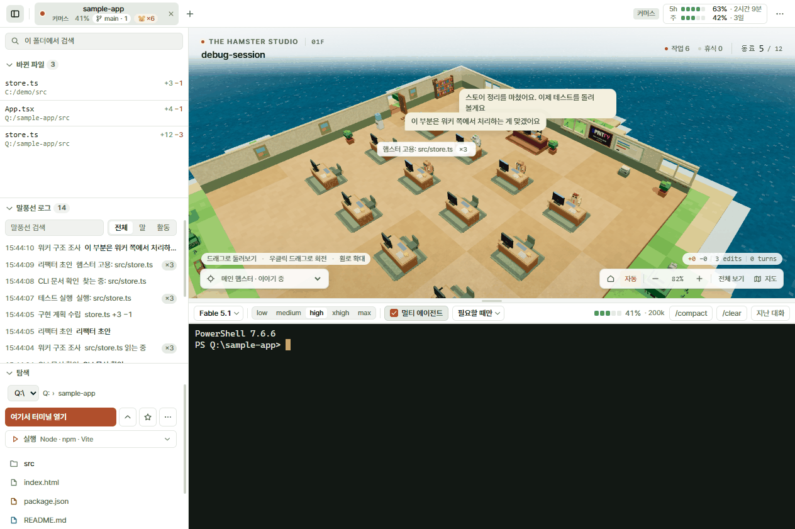
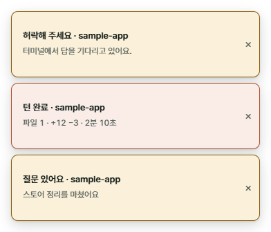

# Hamster Desk

[](https://github.com/chan22222/hamster-desk/releases/latest) · [한국어](README.md)

A Windows desktop app that keeps the Claude Code CLI exactly as it is, and shows who (main agent, subagents) is editing which file right now as voxel hamsters — with usage and versions on the same screen. One window holds **embedded terminal tabs** and the **hamster desk**; you run `claude` in the terminal as usual. No hooks, no proxy, no API key: the app only reads the files Claude Code already writes to disk, so the CLI is not slowed down and your Max/Pro subscription login is used as is.





## Download (Windows)

**[⬇ Get the installer — latest release](https://github.com/chan22222/hamster-desk/releases/latest)** → download and run `Hamster-Desk-Setup-<version>.exe`. No git or node needed, no admin rights asked.

- The app is unsigned, so the first launch shows a "Windows protected your PC" dialog: **More info → Run anyway**.
- Once installed, the app tells you about new versions when it starts — press `Download update`, then **Restart to update**. You never reinstall.
- [Claude Code](https://claude.com/claude-code) itself must be installed separately; it is what you run inside the terminal.
- What changed: [CHANGELOG.md](CHANGELOG.md) (Korean).

## Features

Everything in detail is in [docs/features.md](docs/features.md) (Korean).

- **Embedded terminal** — several node-pty + xterm.js tabs. Copy/paste like Windows Terminal, `Ctrl+F` search, font size, one set of shortcuts. → [터미널](docs/features.md#터미널)
- **Hamster desk** — an office on a voxel island. The main agent sits at the boss's desk; subagents walk in through the door, take a staff desk and show what they are saying and doing in speech bubbles. Per-model skins, an auto camera, the boss doing the rounds. → [책상](docs/features.md#책상-복셀-스튜디오)
- **Languages** — pick one in the `⋯` menu and the whole UI follows: 한국어 · English · 日本語 · 中文 · Español · Deutsch · Français · Português · Русский. → [언어](docs/features.md#언어)
- **Bubble summaries** — long sentences are shortened to one line by Haiku and translated into your language (off by default; about $0.0007 per call on your subscription). → [말풍선 요약](docs/features.md#말풍선-요약)
- **Usage gauge** — the 5-hour and weekly windows (per-model weekly included), percent and time until reset, in one chip on the top bar. → [사용량](docs/features.md#사용량)
- **Session control bar** — change model and effort, a context meter, `/compact` · `/clear`, and a multi-agent instruction switch. → [세션 컨트롤 바](docs/features.md#세션-컨트롤-바)
- **Several accounts** — an account is a `CLAUDE_CONFIG_DIR` folder. Adding one opens a login tab right away; the same folder can be open under two accounts side by side. → [여러 계정](docs/features.md#여러-계정)
- **5-hour window auto-start** — a minute after the limit resets, one short message opens the next window right away (per account, off by default). → [5시간 창 자동 시작](docs/features.md#5시간-창-자동-시작)
- **Notifications** — when the window is in the background, permission requests, questions and finished turns show up in the app's own notification window, with the taskbar button flashing. → [알림](docs/features.md#알림)
- **Sidebar** — changed files (last-edit preview and `git diff`), the bubble log, a file explorer, and a run menu that recognises the project. → [사이드바](docs/features.md#사이드바)
- **Past conversations** — pick one from this folder's list and continue it in a new tab with `claude --resume`. → [지난 대화](docs/features.md#지난-대화-이어서-열기)
- **Git chip** — branch and number of changed paths on the tab. Read-only git commands only. → [Git](docs/features.md#git)
- **Mini mode** — an always-on-top 480×360 window with just the studio and a status line. → [미니 모드](docs/features.md#미니-모드)
- **Tab and window restore**, light/dark themes, desk above or beside the terminal. → [탭·창 복원](docs/features.md#탭창-복원) · [레이아웃](docs/features.md#레이아웃)

## Run from source

```bash
npm install                # .npmrc turns on legacy-peer-deps
npm run build:vite         # builds out/ only (no packaging)
npx electron .             # or npm run dev (HMR)
```

Building the installer, verification commands, capture runs and releases: [docs/development.md](docs/development.md).

## Documentation

The deeper documentation is written in Korean — it is for the people (and agents) who maintain the app.

- [docs/features.md](docs/features.md) — every screen and feature
- [docs/architecture.md](docs/architecture.md) — what the app reads and writes, the file map, the settings file, the update and release pipeline, design tokens
- [docs/development.md](docs/development.md) — running, building, verifying, capture runs, releasing
- [docs/design-notes.md](docs/design-notes.md) — why things are the way they are
- [CONTRIBUTING.md](CONTRIBUTING.md) — what to keep to when changing things
- [CHANGELOG.md](CHANGELOG.md) — changes per version

## License

[Apache-2.0](LICENSE)
