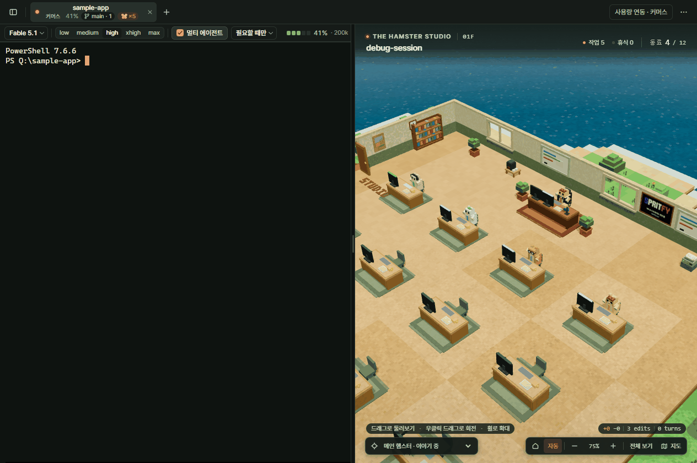

# 화면과 기능

앱의 화면에 보이는 모든 것을 기능마다 한 절씩 적는다. 파일 구조·설정 파일·업데이트 파이프라인은 [구조](architecture.md), 검증 방법은 [개발·검증](development.md), "왜 이렇게 만들었나"의 긴 이야기는 [설계 노트](design-notes.md)에 있다.

화면은 세 덩어리다. 44px 상단 바, 접었다 펴는 왼쪽 사이드바, 그리고 가운데의 복셀 스튜디오 + 터미널. 상태는 상단 바에서 한눈에 보이고, 자세한 건 전부 그 칩을 눌러 여는 팝오버 안에 있다.

## 레이아웃

**레이아웃은 사용자가 움직인다**(전부 `ui.json` 에 저장된다).
- **사이드바 폭**: 오른쪽 가장자리 4px 핸들을 끌면 200~480px, 더블클릭하면 기본값 248px.
- **책상 위치**: `⋯` 메뉴의 `책상 위치` 가 `위`(터미널 위, 높이 220~700px)와 `오른쪽`(터미널 옆, 폭 320~900px) 중 하나. 스플리터는 두 방향 모두 끌어서 조절하고 더블클릭하면 기본값(420 / 520)으로 돌아간다. 오른쪽 배치에서는 컨테이너 쿼리(`container-name: office`)가 좁은 폭을 알아채 스튜디오 오버레이를 알아서 접는다. **책상은 터미널의 최소 크기를 넘보지 않는다**: 옆에 두면 터미널 폭 360px, 위에 두면 터미널 높이 180px 을 남기고, 창이 좁아지거나 사이드바가 넓어지면 그만큼 책상이 줄어든다(저장된 크기는 그대로라 창이 넓어지면 돌아온다; 스플리터도 거기서 멈춘다). 예전에는 760px 창에서 기본값(사이드바 248 + 책상 520)만으로 터미널이 0px 이 됐다.
- 사이드바의 세 섹션(`바뀐 파일`·`말풍선 로그`·`탐색`) 접힘 상태도 저장된다.
- **터미널 탭과 창 위치도 돌아온다**([탭·창 복원](#탭창-복원)).

## 테마

**테마는 라이트와 다크 두 벌**(`⋯` 메뉴의 `테마`: 라이트 · 다크 · 시스템). 고른 값은 `<html data-theme>` 에 쓰이고, `시스템` 이면 `prefers-color-scheme` 를 구독해 OS 를 계속 따라간다(`src/widgets/theme.ts`). 색 토큰과 대비 수치, 3D 오버레이 전용 토큰, 아이콘 한 벌은 [구조 › 디자인 토큰](architecture.md#디자인-토큰과-스튜디오-오버레이)에 있다.

**터미널은 두 테마 모두 어둡다**(`--term-bg` 라이트 `#121814` · 다크 `#0e1310`). Claude Code 가 그 안을 자기 팔레트로 직접 칠하기 때문에 배경을 밝게 하면 CLI 가 쓰는 흐린 색이 전부 사라진다. 테마를 바꾸면 xterm 의 `theme` 도 같이 갱신된다(`src/Terminal.tsx`).

**OS 의 `동작 줄이기`**(Windows: 설정 › 접근성 › 시각 효과 › 애니메이션 효과를 끔)를 따르면 크롬의 움직임이 전부 곧바로 끝난다 — 팝오버와 턴 카드가 떠오르는 것, 말풍선이 들어오는 것, 업데이트 막대, 패널이 접히는 것(`src/styles.css` 끝의 `prefers-reduced-motion` 한 블록; 예전에는 로딩 화면과 알림 카드만 물었다). 스튜디오의 3D 움직임은 자바스크립트라 여기에 닿지 않고, 햄스터 GUI 를 껐다 켤 때의 연출은 그쪽이 따로 건너뛴다([껐다 켜기](#껐다-켜기-핵폭발과-공사)).

## 언어

`⋯` 메뉴의 **언어**: `자동` · 한국어 · English · 日本語 · 中文 · Español · Deutsch · Français · Português · Русский.

- **화면 전체가 그 언어로 바뀐다** — 메뉴·버튼·툴팁·플레이스홀더, 사이드바와 실행 메뉴의 머리줄·명령 이름, 세션 바, 계정 창, 업데이트 안내, 알림 창, 말풍선 고정 문구와 알림 제목, 그리고 메인 프로세스가 만드는 문구(폴더 대화상자 제목, 5시간 창 오류, 자동 업데이트 콘솔, 계정 이름 기본값, `CLAUDE.md` 의 멀티 에이전트 블록)까지. 고르면 다시 켤 필요 없이 그 자리에서 바뀐다(`useUi()` 가 언어 버전을 구독한다). 말풍선 로그와 바뀐 파일에 이미 찍힌 줄의 메인 햄스터 이름도 따라 바뀐다 — 이름은 저장할 때가 아니라 그릴 때 정한다.
- `자동` 은 `~/.claude/settings.json` 의 `language`(원어 이름·영어 이름·로캘 코드 모두 인식, `codeOfLanguage`)를 보고, 없거나 모르는 값이면 시스템 언어, 그것도 표에 없으면 English.
- **사전은 `shared/i18n/`** 에 언어마다 한 파일(`ko.ts` 가 기준: `UiStrings = typeof ko`, 나머지는 그 타입으로 강제돼 키가 하나라도 빠지면 빌드가 실패한다). 빈칸이 있는 문구는 함수라 언어마다 어순이 달라도 된다. `<b>`·`<code>`·` ` 만 든 문구는 `rich()`(`src/rich.tsx`)로 그린다. 렌더러는 `src/i18n.ts` 의 `useUi()`(컴포넌트)·`ui()`(그 외), 메인은 `electron/lang.ts` 의 `tr()` — 같은 `lang` 설정을 `ui.json` 에서 읽으므로 창이 뜨기 전에 쓰는 것도 같은 언어다(단위 테스트는 `HAMSTER_LANG` 으로 고정).
- 한국어보다 긴 언어(영어·독일어·러시아어)에서 줄이 밀리지 않게: 세션 바의 모델·방식 알약은 152px 에서 말줄임, 계정 행의 사용량 줄은 접혀 내려가고, 지난 대화의 `--continue` 행은 한 줄로 말줄임, 실행 메뉴·멀티 에이전트 메뉴는 넓혔다(360·440px). 사전의 영어는 일부러 짧게 골랐다.
- 자동 업데이트 콘솔의 문구는 PowerShell 작은따옴표 문자열 안에 들어가므로 `'` 와 U+2018~U+201B 를 `''` 로 바꿔 넣고(`psLiteral`), 사전 검사(`scripts/unit/i18n.test.ts`)가 모든 언어에서 그 문구에 따옴표가 없는지·키가 빠지지 않았는지·`<b>` 가 닫혔는지, 빈칸이 있는 문구가 한국어와 같은 인자를 받아 빠짐없이 찍는지 본다.
- **날짜는 그 언어의 모양으로 쓴다**(`src/i18n.ts` 의 `formatDate` — `Intl.DateTimeFormat`). 달은 숫자가 아니라 이름이다: ko `9월 12일` · en `Sep 12` · de `12. Sept.` · fr `12 sept.` · ru `12 сент.`. 예전의 `9/12` 는 독일어·프랑스어·스페인어·포르투갈어·러시아어를 쓰는 사람에게 12월 9일로 읽혔다. 올해가 아니면 연도가 붙고, 시각은 어느 언어든 24시간제(`18:05`, 칩에 `PM` 을 넣을 자리가 없다). 최근 프로젝트·지난 대화의 날짜, 사용량 초기화 시각, 5시간 창 자동 시작, 말풍선 요약 카운터의 시작일이 이 한 곳을 쓴다. 개수가 하나면 단수다(`1 summary` · `1 resumen` · `1 cambiado`).

## 상단 바

한 줄이다.

- 맨 왼쪽 패널 아이콘 = 사이드바 열고 닫기(`Ctrl+B`). 그 옆 🐹 는 앱 표시.
- 터미널 탭은 **두 줄**이다. 윗줄은 대화 제목 하나뿐이고(제목이 아직 없으면 폴더 이름), 아랫줄에 폴더 이름과 칩들 — 계정 이름(계정이 둘 이상일 때), **컨텍스트 `72%`**(사용량 연동 시, 70% 부터 주의색 · 90% 부터 경고색), **git `⎇ main · 3`**(그 탭 폴더의 브랜치와 바뀐 경로 수, 0 이면 숫자 생략), `🐹×N`(서브에이전트 수) — 이 온다. 예전에는 한 줄에 다 붙어서 제목이 `예약메시지 및 5시…` 로 짓눌렸다. 아랫줄에 쓸 것이 없으면 제목만 가운데에 온다. 각 탭에서 띄운 `claude` 세션은 프로세스 계보로 그 탭에 묶인다 — 제목 앞의 표시가 상태다: 회색 점 = 대기, 고리 두른 주황 점 = 작업 중, 그리고 **권한 요청·질문에 답을 기다리는 탭은 색만이 아니라 모양으로** — 점이 빨간 `!` 배지가 되고 탭 전체가 호박색 바탕에 테두리를 두른다(뒤에 있는 탭이 나를 기다리는 것이 가장 중요한 신호라서). 상태는 탭의 툴팁과 스크린 리더에게 글로도 간다. 다른 터미널에서 돌아가는 세션은 기울임체 탭으로 붙고 책상만 볼 수 있다. **탭이 줄에 다 들어가지 않으면** 줄이 옆으로 스크롤된다: 휠로 넘기고, 더 있는 쪽 끝이 흐려지며, 앞에 온 탭(`Ctrl+T` · `Ctrl+1~9` · 알림 클릭)은 늘 보이는 곳까지 스크롤된다. `+` 는 스크롤되는 줄 밖, 마지막 탭 바로 뒤에 있어서 탭이 많아도 밀려나지 않는다. 키보드로는 탭 줄이 Tab 한 번에 들어가는 한 칸이고 `←` `→` `Home` `End` 로 옮겨 `Enter` 로 연다. Claude 가 실행 중인 탭의 `×` 는 바로 닫지 않고 "그래도 닫기" 를 한 번 묻는다. 창 폭이 1180px 아래로 내려가면 git 칩은 브랜치 이름을 놓고 아이콘 + 숫자만 남긴다. 폴더 경로 전체는 툴팁에 있다.
- `+` 아이콘은 **"새 터미널" 화면**이다(320px 팝오버): 검색 한 칸 + **이 앱에서 연 프로젝트 전체 목록**(즐겨찾기 먼저, 그다음 최신순, 최대 420px 스크롤; 행에 마우스를 올리면 ★ 즐겨찾기와 × 목록에서 지우기) + `폴더 찾아보기…`(시스템 폴더 선택 창) + `사이드바에서 고르기`. 사라진 폴더는 취소선으로 흐리게 나오고, 눌러도 열리는 대신 `폴더를 찾을 수 없어요` 한 줄을 띄운다(× 로 지우면 된다). 터미널이 하나도 없으면 같은 목록이 가운데 시작 카드로 나온다. 키보드로도 다 된다: 열면 검색 칸에 커서가 있고, `Enter` 는 첫 결과를 열고 `↓` 는 목록으로 내려간다. 목록은 Tab 한 칸이고 `↑` `↓` 로 옮기며, 포커스가 간 행에는 ★ 와 × 가 마우스를 올린 것처럼 보인다(예전 행은 `div` 라 키보드로 열 수 없었다).
- 오른쪽 상태 칩(순서 고정, 전부 팝오버):
  - **사용량**: 5시간·주간 게이지. 아래 [사용량](#사용량).
  - **업데이트**: 설치된 Claude Code 보다 새 버전이 npm 에 있을 때만(1시간마다 확인). 누르면 새 터미널 탭에서 `claude update`.
  - 알약은 220px 에서 말줄임한다(전체 문구는 툴팁). `.status` 는 줄어들지 않는 칸이라, 긴 번역(`Utilisation en attente · <계정>`, `Загрузка обновления 100%`)이 그만큼 탭 줄의 폭을 가져갔다. 창이 1100px 아래로 좁아지면 `앱 업데이트` 알약은 아이콘만(받는 중이면 `45%` 도) 남고, 사용량 알약은 뒤에 붙인 `· 계정` 을 놓는다 — 사용량 칩 앞의 계정 이름도 이 폭에서 빠진다. Claude Code 의 `업데이트` 알약은 어느 언어든 짧아서 접지 않는다: 둘 다 아이콘만 남으면 주황 다운로드 아이콘 두 개가 어느 게 어느 업데이트인지 말하지 못한다.
  - **⋯**(점 세 개): `사이드바 (Ctrl+B)` · `햄스터 GUI` · `바뀐 파일` · `항상 위` · `미니 모드 (Ctrl+Shift+M)` 체크 항목, **계정**(전환·추가 후 바로 로그인·이름 바꾸기·지우기 — [여러 계정](#여러-계정)), **5시간 창 자동 시작**(계정별, [아래](#5시간-창-자동-시작)), **알림** 의 `권한 요청`·`질문`·`턴 완료`·`소리`, `터미널 글꼴`(12·13·14·16), `책상 위치`(위·오른쪽)와 `테마`(라이트·다크·시스템) 라디오, **말풍선** 의 `요약해서 말하기`(요약기를 쓸 수 없으면 비활성 + 이유)와 **언어**(자동/한국어/English/日本語/中文/… — 말풍선만이 아니라 화면 전체가 바뀐다, [언어](#언어)), **Claude Code** 의 현재 버전·`다시 확인`·업데이트 설치, 그리고 맨 아래 11px 로 `설정 파일: ~\.hamster-desk\ui.json`(누르면 탐색기에서 열린다).

## 사용량

5시간과 주간이 **칩 하나에 두 줄로** 쌓여 있다 — 윗줄 `5h ▰▰▰▰▱ 81% · 2시간 10분`, 아랫줄 `주 ▰▰▱▱▱ 42% · 3일`. 예전에는 나란한 칩 둘(사이에 세로 hairline)이라 상단 바에서 가장 넓은 것이었는데(1280px 창에서 328px), 쌓으니 긴 줄 하나의 폭(166px)만 차지하고 바 높이는 그대로다(11px 두 줄 = 32px, 옆 알약은 28px, 바는 44px). 한 줄은 라벨 + 5칸 세그먼트 미터 + 퍼센트 + 남은 시간이고, 라벨과 퍼센트의 폭이 고정이라 두 줄이 세로 열로 맞는다. 채운 칸수는 `⌈pct/20⌉`, 색은 `<70%` 초록(`--ok` — 강조색이 아니라 상태색) · `70~89%` 주의색 · `≥90%` 경고색이고 같은 단계 색이 퍼센트 글자에도 붙는다. **초기화까지 남은 시간은 늘 붙어 있다** — `· 2시간 10분`(1시간 미만이면 `38분`, 하루 넘게 남았으면 `3일`). 30초마다 다시 계산한다. 초기화 **시각**(`18:20`)은 칩의 툴팁(창마다 한 줄)과 팝오버에 있다. 창이 좁아지면 칩은 덜 중요한 순서로 조각을 놓는다: 1020px 아래에서 남은 시간(→ 111px), 900px 아래에서 세그먼트(퍼센트 숫자와 중복이다, → 68px) — 두 줄은 어느 폭에서도 남는다(아랫줄은 폭을 먹지 않으니 접을 이유가 없다). 칩을 누르면 팝오버에 두 창의 막대·퍼센트·초기화 시각·남은 시간과 `연동 해제`. 아직 연동 전이면 칩이 `사용량 연동` 이고, 팝오버의 설명 아래 `연동하기`(다른 상태줄이 이미 있으면 `기존 상태줄 교체하기`)를 누르면 `~/.claude/settings.json` 에 `statusLine` 항목을 넣고 `~/.hamster-desk/statusline.cjs` 를 설치한다. `settings.json` 이 있는데 읽을 수 없으면(JSON 이 아니거나, 다른 프로그램이 잡고 있으면) **아무것도 쓰지 않고** 팝오버에 이유를 띄운 채 닫히지 않는다 — 칩 안의 `연동 해제` 가 그렇게 실패하면 칩 옆에 `설정 파일 오류` 알약이 남는다. 바꿀 때마다 직전의 파일이 `settings.json.hamster-bak` 으로 남는다. Claude Code 가 대화가 갱신될 때마다 이 스크립트를 **비동기로**(300ms 디바운스, 모델 호출을 막지 않음) 실행해 JSON 을 남기고, 터미널 하단에도 `Fable 5.1 · high · 5h 63% (18:20) · 7d 15% (9/21 10:00)` 한 줄이 표시된다. 첫 메시지 전에는 칩이 `사용량 대기 중`. **주간 창은 하나가 아니다**: Max 플랜에는 모든 모델을 합친 주간 창 말고도 **모델별 주간 창**(`Current week (Fable)` — CLI 의 `/usage` 화면에 나오는 것)이 따로 있고, 그쪽이 먼저 찬다. 상태줄 JSON 은 응답 헤더에서 오는 5시간·주간(전체) 둘만 실어서 앱은 그 창을 볼 수 없었다. 그래서 `electron/usage-query.ts` 가 로그인된 계정마다 **CLI 에 직접 묻는다**: 헤드리스 `claude -p --input-format stream-json` 에 SDK 제어 요청 `get_usage` 한 줄을 stdin 으로 넣으면 `rate_limits.model_scoped`(`[{display_name:"Fable", utilization, resets_at}]`)가 담긴 `control_response` 가 오고 stdin 을 닫으면 끝난다 — 모델 호출도 토큰 소비도 없고, usage 엔드포인트만 그 계정의 로그인으로 묻는다. 켤 때(20초 뒤)와 10분마다, 그리고 팝오버의 `다시 확인` 으로. 칩의 **아랫줄은 주간 창들 중 가장 찬 것**이다(`주 ▰▰▰▰▱ 74% Fable · 3일` — 모델 창이면 숫자 뒤에 모델 이름), 팝오버에는 `주간 (전체)` · `주간 (Fable)` … 전부가 나오고, 계정 목록의 한 줄 요약(`주·Fable 74%`)도 같은 규칙이다. 상태줄 스냅샷이 새로 와도 모델별 창은 지워지지 않는다(`src/store.ts` 의 `usage_windows`). 캡처 실행은 묻지 않는다.

## 사이드바

사이드바 아이콘 또는 `Ctrl+B`, 기본 숨김 — `[바뀐 파일 N ▾] / [말풍선 로그 N ▾] / [탐색 ▾]`

### 바뀐 파일

**바뀐 파일**: 활성 세션이 고친 파일들이다(예전엔 오른쪽 300px 패널이었다). **아직 고친 것이 없어도 섹션은 한 줄로 보인다** — 흐린 머리줄에 이름과 `0` 만 있고 펼쳐지지 않는다(설명 문구는 넣었다가 뺐다: 이름으로 충분하다). 예전에는 첫 편집이 있어야 섹션이 생겨서, 써 보기 전에는 그런 것이 있는 줄 알 수 없었다. 말풍선 로그도 같다. 세 섹션은 사이드바를 **고르게 나눠 쓴다**: 바뀐 파일과 말풍선 로그는 각각 높이의 **최대 1/3**(내용이 적으면 그만큼만)까지 차지하고 그 안에서 스크롤하며, 탐색은 나머지를 채우되 1/3 아래로 줄지 않는다. 접은 섹션은 머리줄만 남는다. **높이는 끌어서 바꿀 수 있다**: 바뀐 파일과 말풍선 로그의 아래쪽 가장자리를 위아래로 끌면 그 섹션의 높이가 되고(`prefs.sideChangedH` · `sideFeedH`, 최소 84px, 사이드바 폭처럼 끄는 동안은 스토어에만 쓰고 놓을 때 한 번 저장), 탐색이 나머지를 가진다. 끌어 둔 섹션에는 "최대 1/3" 이 적용되지 않지만 창이 낮아지거나 탐색이 1/3 에 닿으면 줄어들 수는 있어서, 놓을 때 저장하는 값은 요청한 높이가 아니라 **화면에 실제로 잡힌 높이**다. 가장자리를 더블클릭하면 자동 배치(`null`)로 돌아간다. 한 행은 두 줄 — 파일명(모노 12px)과 오른쪽 끝 `+N −N`, 그 아래 11px 경로(끝이 남게 말줄임). 클릭하면 마지막 Edit/Write 의 old/new 미리보기가 그 자리에서 펼쳐진다(지운 줄 붉은 바탕, 넣은 줄 초록 바탕). 횟수·누가·언제는 행 툴팁에. 미리보기 머리줄 오른쪽의 **`git diff`** 를 누르면 Edit 한 번의 old/new 가 아니라 **작업 트리의 실제 diff** 로 바뀐다(추가 초록 · 삭제 붉은색 · hunk 머리줄 흐리게; 아직 git 에 없는 파일이면 `아직 git 에 없는 파일이에요`, 20,000자를 넘으면 잘렸다는 꼬리표).

### 말풍선 로그

**말풍선 로그**: 머리 위 말풍선은 몇 초면 사라지지만 여기에는 남는다(세션별 최근 500줄, 세션이 사라지면 같이 사라진다). 검색 한 칸 + `전체·말·활동` 필터, 최신이 위. 한 줄은 `HH:MM:SS · 이름 · 글`(겹쳐 센 줄은 `×N`, 원문은 툴팁, 요약이 도착하면 같은 줄의 글이 바뀐다). **줄을 누르면 그 자리에서 펼쳐진다**: 말풍선은 머리 위에 들어갈 한 줄로 줄인 것이라, 펼치면 실제로 한 말·한 일의 원문(`raw`)이 전부 나오고(선택·복사 가능, 길면 그 안에서 스크롤) 누가·언제·몇 번이 함께 보인다. 그 안의 `햄스터 보기` 가 예전의 줄 클릭 — 그 햄스터로 카메라가 간다 — 이고, `복사` 는 원문을 클립보드에 넣는다. **스튜디오의 말풍선을 눌러도 여기로 온다**: 사이드바와 이 섹션이 닫혀 있으면 열고, 검색·필터를 비우고, 그 줄을 펼쳐 화면 안으로 스크롤한다(말풍선과 로그 줄은 같은 id 다). 말풍선을 치우는 것은 우클릭으로 옮겼다. 이미 퇴근한 햄스터의 줄은 흐리게 나온다. 새 프롬프트가 머리 위 피드를 비워도 로그는 그대로다. 사이드바 높이의 최대 1/3.

### 탐색

- **탐색**: 드라이브 · 경로 조각 · 하위 폴더에 이어 **파일**도 보인다. 폴더는 클릭 = 들어가기, 더블클릭 또는 `열기` = 터미널 열기. 파일은 더블클릭 = 기본 앱으로 열기, 우클릭 = 경로 복사 · 탐색기에서 보기 · 기본 앱으로 열기. 아래 줄에 `터미널 이동`(앞에 있는 터미널에 `Set-Location -LiteralPath '<폴더>'` 를 쳐서 그 폴더로 옮기고, 탭의 폴더·이름·git 칩과 탐색이 따라간다; `src/sidebar/recent.ts` `cdCommand`, `store.moveWorkspace`), `터미널 새 탭`(그 폴더의 터미널을 새 탭으로) 두 버튼과 아이콘 버튼 셋 — 위로 · 즐겨찾기 · `…`(시스템 폴더 선택 창). 주황(주 버튼)은 **지금 누를 수 있는 쪽**이다: 보통은 `터미널 이동` 이지만, 터미널이 없거나 그 탭에 claude 가 실행 중이면 — 대부분의 시간이 그렇다 — `터미널 이동` 은 비활성이 되고 주황은 `터미널 새 탭` 으로 가며, 왜 옮길 수 없는지는 버튼 아래 한 줄로 나온다(예전에는 비활성 버튼의 툴팁에만 있어 키보드로는 볼 수 없었다). 사이드바가 340px 보다 좁으면(기본 248px 포함) 두 글자 버튼이 한 줄, 아이콘 셋이 다음 줄에 온다 — 한 줄에 다 넣으면 글자 버튼 하나에 50px 쯤밖에 안 남아 `터미널 이동` · `Nouvel onglet` · `Новая вкладка` 가 모두 잘렸다. **그 아래, 지금 폴더가 프로젝트로 보이면 `▶ 실행 · Node · pnpm · Vite ▾` 알약 한 줄이 더 생긴다**(아무것도 아닌 폴더에는 없다 — 빈 메뉴는 없다). 이 줄이 위 행의 네 번째 버튼이 아닌 이유: 기본 폭 248px 에서 그 행은 16px 밖에 남지 않아 `여기서 터미널 열기` 의 꼬리가 잘린다. 알약 자체가 무엇을 알아봤는지 말하므로 열어 보지 않아도 폴더의 종류가 보인다.
- 탐색은 **앞에 있는 터미널의 폴더를 따라간다**: 폴더 찾아보기·최근 프로젝트·즐겨찾기·`터미널 새 탭`·폴더 더블클릭으로 터미널을 열면 그 폴더로 옮겨 가고(`터미널 이동`도 탭의 폴더를 바꾸므로 같다), 다른 폴더의 탭으로 바꿔도 따라간다(`explorerDir`, `src/sidebar/recent.ts`). 탭이 하나도 없을 때(시작 카드)는 다음 터미널이 열릴 폴더(`lastCwd`), 그것도 없으면 홈에서 시작하고, 마지막 탭을 닫아도 있던 자리에 머문다. 앱의 실행 폴더로는 가지 않는다 — 예전에는 사이드바가 첫 탭보다 먼저 떠서 빈 경로를 한 번 나열하고 그 뒤로는 움직이지 않았는데, 빈 경로의 목록은 프로세스의 작업 폴더, 곧 설치판의 설치 폴더(`npx electron .` 이면 저장소)였다. `fs:list`·`fs:listDirs` 도 이제 빈 경로를 홈으로 본다.
- `이 폴더에서 검색` 한 칸이 탐색 목록을 거른다. **탐색 섹션 안, 목록 바로 위**에 있다 — 예전에는 사이드바 맨 위에 있어서 그 아래 전부(바뀐 파일·말풍선 로그)를 찾는 칸처럼 보였고, 탐색을 접어 두면 쳐도 아무 일이 없었다. 지금 폴더를 거르는 칸이라 다른 폴더로 가면 비워진다. 목록 행은 좌우 6px 마진 + 라운드로 카드처럼 떨어져 있고, 폴더 아이콘은 `.git` 이면 branch, `CLAUDE.md`/`.claude` 면 🐹 다. 검색 칸 모양은 앱 전체가 하나다(말풍선 로그·`+` 메뉴·지난 대화의 검색 칸도 같은 28px 상자·테두리·포커스 링).
- **키보드**: 검색 칸에서 `Enter` 는 첫 결과(폴더면 들어가고 파일이면 연다), `↓` 는 목록으로. 목록은 Tab 한 칸이고 `↑` `↓` `Home` `End` 로 옮긴다(첫 행에서 `↑` 는 검색 칸으로). 폴더 행은 `Enter` = 들어가기, 그 뒤 Tab 한 번이 그 행의 `열기`(포커스가 오면 보인다). 파일 행은 `Enter` = 기본 앱으로 열기, **메뉴 키나 `Shift+F10`** = 우클릭 메뉴. 우클릭 메뉴는 창 밖으로 나가지 않게 자리를 잡고(창 아래쪽 파일에서 반쯤 잘렸다), 열리면 첫 줄에 포커스가 가며 `↑` `↓` 로 옮기고 `Esc`·Tab 으로 닫으면 포커스가 그 파일로 돌아간다. 파일을 열지 못했다는 줄은 `×` 로 닫거나 다른 폴더로 가면 사라진다.
- **최근 목록은 사이드바에 없다.** 늘 보고 있을 것이 아니라 새로 시작할 때 필요한 것이라, `+`(새 터미널)과 빈 화면의 시작 카드에만 있다. 두 곳 다 설정 가방(`uiGet`)에서 **가방이 바뀔 때마다 다시 계산**한다(`DeskState.uiRev`: 파일을 읽었을 때와 `uiSet` 마다 하나씩 오른다). 시작 카드는 파일을 읽기 **전에** 먼저 뜨는데, 예전에는 그때 `useState` 로 한 번 계산한 목록을 끝까지 들고 있어서 켤 때마다 "아직 이 앱에서 연 프로젝트가 없어요" 로 시작했다 — `+` 를 열면(그때 새로 마운트되므로) 다 있었으니 "껐다 켜면 즐겨찾기·최근이 사라진다" 로 보였다. 이제 사이드바의 별과 카드의 별도 서로 바로 따라간다.
- 파일 목록은 `fs:list`(이름순, 숨김 제외, 최대 500개, 크기·수정 시각·확장자). **최근 프로젝트는 이 앱에서 터미널을 연 기록(`ui.json` 의 `recents`: 경로·마지막 시각·횟수)만 쓴다** — 앱은 이제 Claude Code 의 CLI 사용 이력 파일(`~/.claude/history.jsonl`)을 **전혀 읽지 않는다**(`projects:recent` IPC 를 통째로 지웠다). 목록의 폴더가 아직 있는지는 `fs:exists` 한 번으로 확인한다.

### 실행 메뉴

**실행 메뉴**(`src/sidebar/Sidebar.tsx` 의 `RunMenu`, 판정은 `electron/project-actions.ts`): 알약을 누르면 맨 위에 흐린 배지 줄(`Node · pnpm · Vite`, 두 가지면 `Node · npm · Next + Make`), 그 아래 `개발 · 빌드 · 테스트 · 설치 · 기타` 머리줄(`.run-head`: 10.5px 굵은 흐린 글씨에 앞에 주황 눈금, 그룹 사이 가는 줄, 행은 머리줄보다 들여쓴다 — `.pop-head` 로 두었을 때는 `개발` 과 그 아래 `개발 서버` 가 같은 목록의 두 줄로 읽혔다)로 묶인 행들이 온다. 한 행은 왼쪽에 이름(`개발 서버`), 오른쪽에 **실제로 쳐질 명령**이 모노 글꼴로 흐리게(`pnpm dev`; 전부는 툴팁에). 행을 누르면 **새 터미널 탭**이 그 폴더에서 열리고 셸이 뜬 뒤 그 명령이 쳐진다 — 계정 추가의 로그인과 같은 `runOnce` 다(`initialCommand` 가 아니다): 탭은 그 폴더의 보통 터미널이라 폴더 이름이 붙고, `Ctrl+C` 로 개발 서버를 끄면 그냥 그 폴더의 셸이며, **다음 실행에 되돌아올 때는 셸만 돌아오고 명령은 다시 치지 않는다**(`src/workspaces-persist.ts` 는 명령을 저장하지 않는다). 새 탭이 열리므로 이미 돌고 있는 것을 방해하지 않는다.

- **판정은 폴더의 맨 윗단만 읽는다**: `readdir` 한 번, 아는 표식 파일들의 `stat`, 그리고 실제로 파싱하는 몇 개(`package.json` · `Makefile` · `pyproject.toml` · `pom.xml` · `build.gradle`)의 내용뿐이다. 아래로 내려가지 않고 아무것도 실행하지 않는다. 결과는 **폴더의 mtime + 표식 파일들의 `크기:mtime`** 으로 캐시한다(`electron/transcripts.ts` 와 같은 방식) — 폴더에 항목이 생기거나 없어지면(`node_modules`, `.venv`, 잠금 파일) 폴더의 mtime 이, 표식을 고치면 그 파일의 것이 움직이므로 지난 답이 아직 맞는지 그것으로 안다. 탐색이 폴더를 옮길 때마다 `fs:list` 와 **같은 왕복**으로 `fs:project` 를 묻고, 늦게 온 답은 버린다(`goSeq`).
- **표식 → 배지 → 명령**:

  | 표식 | 배지 | 명령 |
  |---|---|---|
  | `package.json` | `Node · <러너> · <프레임워크>` | `scripts` 전부(최대 30, `pre*`/`post*` 훅 제외). `dev · start · serve · preview · build · test · lint` 를 이 순서로 먼저, 나머지는 파일 순서로 `기타` 에(`build:vite` · `test:unit` 처럼 `:` 앞이 아는 이름이면 그 묶음으로). `node_modules` 가 없으면 `설치` 에 `<러너> install` |
  | `pyproject.toml` · `requirements.txt` · `setup.py` · `manage.py` · `Pipfile` · `uv.lock` · `poetry.lock` | `Python · uv|poetry|pipenv|venv · Django` | Django(`manage.py`): `runserver` · 테스트(`pytest` 설정이나 `tests` 폴더가 있으면 `pytest`, 아니면 `manage.py test`) · `migrate`. 그 밖에는 `main.py`/`app.py` 가 있으면 `실행`, `pytest` 흔적이 있으면 테스트. 설치는 `uv sync` · `poetry install` · `pipenv install` · `pip install -r requirements.txt` · `pip install -e .` 중 맞는 것 |
  | `Cargo.toml` | `Rust` | `cargo run` · `cargo build` · `cargo test` · `cargo check` |
  | `go.mod` | `Go` | `go run .` · `go build ./...` · `go test ./...` |
  | `*.csproj` · `*.fsproj` · `*.sln` | `.NET` | `dotnet run` · `dotnet build` · `dotnet test` |
  | `pom.xml` | `Maven` | `mvn clean package` · `mvn test`, 파일에 `spring-boot` 가 있으면 `mvn spring-boot:run` |
  | `build.gradle(.kts)` | `Gradle` | `build` · `test`(`gradlew` 가 있으면 `.\gradlew.bat`/`./gradlew`, 없으면 `gradle`), `application` 플러그인이면 `run`, Spring Boot 면 `bootRun` |
  | `Gemfile` | `Ruby` · `Ruby · Rails` | `bundle install`; `bin/rails` 가 있으면 `bundle exec rails server`, `spec` 폴더면 `bundle exec rspec` |
  | `Makefile` · `makefile` · `GNUmakefile` | `Make` | 타깃마다 `make <타깃>`(최대 12개, 파일 순서). 줄 머리의 `이름:` 만 세고 `.PHONY` 같은 `.` 타깃 · `%` 패턴 · `이름 :=` 변수 · 탭으로 시작하는 레시피 줄은 뺀다. **`make` 가 PATH 에 있을 때만**(`findOnPath`) |
  | `docker-compose.yml` · `compose.yaml` | `Docker Compose` | `docker compose up` · `docker compose down`. `docker` 가 PATH 에 있을 때만 |

- **러너 규칙**(Node): `package.json` 의 `packageManager` 필드가 있으면 그것(`pnpm@9.1.0` → pnpm), 없으면 잠금 파일 — `pnpm-lock.yaml` → pnpm · `yarn.lock` → yarn · `bun.lockb`/`bun.lock` → bun — 그것도 없으면 npm. 명령은 사람들이 실제로 치는 꼴이다: npm 은 `npm run dev` 지만 `npm start` · `npm test`; pnpm·yarn 은 위의 일곱 이름을 `pnpm dev` 처럼 바로, 그 밖의 스크립트는 자기 명령과 겹칠 수 있어 `pnpm run typecheck`; bun 은 늘 `bun run <스크립트>` — `bun test` 는 스크립트가 아니라 bun 의 테스트 러너다.
- **venv 규칙**(Python): `uv.lock` 이면 `uv run …`, `poetry.lock`(또는 `[tool.poetry]`) 이면 `poetry run …`, `Pipfile` 이면 `pipenv run …` — 이 셋은 환경을 스스로 고른다. 그 밖의 프로젝트에 `.venv` 나 `venv` 폴더가 있으면 **먼저 활성화하고 잇는다**: Windows(PowerShell) 는 `.venv\Scripts\Activate.ps1; python manage.py runserver`, 그 밖에는 `source .venv/bin/activate && python3 manage.py runserver`. venv 의 python 을 경로로 직접 부르는 대신 활성화를 고른 이유: 명령이 끝난 뒤에도 그 셸이 venv 안에 있어서, 다음에 치는 것도 거기서 돈다(PowerShell 은 구분자가 든 경로라 `.\` 없이도 스크립트를 실행한다; 실행 정책이 `Restricted` 면 활성화만 실패하고 뒤의 명령은 전역 python 으로 돈다). 메뉴의 행에서는 이 활성화 부분이 모든 행에 똑같으므로 폭이 모자랄 때 **그쪽이 먼저 줄고** 뒤의 명령은 남는다. python 은 Windows 에서 `python`, 그 밖에서 `python3`.
- 새로 `npm install` 을 해서 `node_modules` 가 생긴 뒤에도 메뉴는 폴더를 다시 나열할 때(다른 폴더에 갔다 오거나 탭을 바꿀 때) 갱신된다 — 폴더를 감시하지는 않는다.

## 여러 계정

`⋯` 메뉴의 **계정**.

- Claude Code 는 로그인·설정·MCP·메모리·대화 기록을 전부 **설정 폴더 하나**에 두고, 어느 폴더를 쓸지는 환경 변수 `CLAUDE_CONFIG_DIR` 이 정한다. 그래서 이 앱에서 계정 = 폴더다. **화면에는 "기본 계정"이 없다**: 모든 계정이 똑같이 등록되어 있고 그중 하나가 **활성**(새 터미널이 열리는 계정, 목록에 `활성` 표시)일 뿐이다. CLI 가 원래 쓰는 곳(`~/.claude`)도 그 목록의 한 계정이다 — 이름을 지어 주기 전에는 다른 계정처럼 로그인 이메일의 앞부분으로 불리고(로그인 전이면 `계정 1`), 로그인도 같은 `로그인` 버튼으로 한다. 다른 점은 둘뿐이다: 앱은 그 계정의 터미널에 변수를 **아예 넣지 않고**(다른 터미널에서 쓰던 것과 완전히 같다), 그 계정의 `×` 는 지우기가 아니라 **목록에서 빼기**다 — 앱이 만든 폴더가 아니고 다른 터미널의 Claude 도 거기서 로그인하므로, 로그인과 `~/.claude` 는 그대로 두고 그 계정으로 열린 탭만 닫은 뒤 목록에서 감춘다(`ui.json` 의 `profiles.hideDefault`, 감춘 동안은 그 폴더의 세션을 보지 않는다). 계정 메뉴의 `CLI 계정(~/.claude) 다시 표시` 로 되돌린다. 마지막 남은 계정은 어느 것이든 뺄 수 없다. (저장되는 이름은 여전히 `기본` 이라 예전 빌드도 같은 파일을 그대로 읽는다.) 계정 메뉴의 각 행에는 그 계정이 **마지막으로 알려 준 사용량**이 한 줄로 나온다(`5h 81% · 주 42% · 3분 전` — 상단 게이지의 `계정별 사용량` 과 같은 숫자, 아직 한 번도 보고된 적이 없으면 아무것도 없다). 추가한 계정은 `~/.hamster-desk/profiles/acc-N` 빈 폴더로 시작하고, 그 계정의 터미널에만 `CLAUDE_CONFIG_DIR=<그 폴더>` 가 붙는다.
- **추가**: `⋯ > 계정 > 계정 추가` → 이름(예: `회사`) → `추가 후 로그인`. 그 계정이 현재 계정이 되고, **그 계정의 터미널 탭이 새로 열리면서 `claude auth login` 이 바로 실행된다**(브라우저 로그인 창). 로그인이 끝나면 같은 탭에서 `claude` 가 이어서 뜬다. 추가가 실패하면 입력 칸과 이름이 그대로 남고 그 아래에 `계정을 추가하지 못했어요` 가 나온다(예전에는 `Enter` 를 누르자마자 칸이 닫혀서, 실패해도 아무 일도 없었던 것처럼 보였다). 이름 바꾸기·지우기가 실패해도 그 행 아래에 한 줄이 나온다. 이미 열려 있던 탭에서 `/login` 을 치면 안 된다 — 그 탭은 열 때의 계정(보통 기본 계정)이라 엉뚱한 계정이 로그인된다. 로그인 전인 계정은 목록 행에 `로그인` 버튼이 남아 있어 언제든 같은 흐름을 다시 시작할 수 있고, 로그인한 뒤에는 그 자리에 이메일이 보인다(CLI 가 계정 폴더에 적어 둔 `.claude.json` 을 읽기만 한다).
- **전환**: 계정이 둘 이상이면 `+`(새 터미널) 화면 맨 위에 **계정 알약**이 나온다. 누른 계정이 **활성 계정**이 되고, 그 뒤에 여는 터미널(`+` · `Ctrl+T` · 사이드바의 `여기서 터미널 열기` · 지난 대화)이 그 계정으로 열린다. `⋯ > 계정` 목록에서 계정 행을 누르면 활성이 될 뿐 아니라 **그 계정의 새 터미널이 바로 열린다**(앞 탭의 폴더에서; 메뉴는 닫힌다) — 계정을 고르고 `+` 를 찾는 두 걸음이 한 뜻이라서. **켤 때는 계정을 묻는다**(`AccountGate`): 계정이 둘 이상이거나 **하나뿐인 계정이 아직 로그인 전이면** 로딩 뒤 창 한가운데에 `어느 계정으로 시작할까요?`(로그인 전이면 `먼저 로그인할까요?`)가 떠서 하나를 고르기 전에는 넘어가지 않는다. 행은 `⋯ › 계정` 목록과 같은 모양이고(지난번 계정에 `지난번` 표시와 포커스, Enter 로 그대로), 로그인 전 계정에는 `로그인` 버튼(그 계정의 터미널에서 `claude auth login` → `claude`; 지난번 계정이 로그인 전이면 여기에 포커스), 맨 아래에 `계정 추가`(이름 → 추가 후 로그인)가 있다 — 어느 쪽이든 누르면 창이 닫히고 그 계정이 활성이 된다. 돌아온 탭들은 각자 열 때의 계정 그대로다. 업데이트 안내와 같이 뜨면 계정이 위에 온다. 캡처 실행에서는 뜨지 않는다. **이미 열린 탭은 열 때의 계정 그대로다** — 셸이 그 환경 변수로 떠 있어서 나중에 바꿀 수 없다. 그래서 탭 이름 옆에 작은 계정 배지가 붙고, 같은 폴더를 두 계정으로 나란히 열어 둘 수 있다. 앱을 다시 켜면 탭은 각자 쓰던 계정으로 돌아온다.
- **계정별 사용량**: 상단 5h·주간 게이지는 **앞에 있는 탭의 계정** 것이고(게이지 앞에 계정 이름이 붙는다), 게이지를 누르면 팝오버 아래 `계정별 사용량` 에 모든 계정의 `5h 81% · 주 42% · 3분 전` 이 나란히 나온다. 사용량은 CLI 가 **그 계정으로 대화할 때만** 알려 주므로, 안 쓰고 있는 계정은 마지막으로 본 숫자와 그게 언제 것인지를 보여 준다(초기화 시각이 지난 창은 `초기화됨`/0% 로 친다). 상태줄 연동은 계정마다 settings.json 이 따로라 **계정별로** 켠다 — 같은 팝오버의 `연동하기`. 어느 계정의 숫자인지는 상태줄 스크립트가 자기 `CLAUDE_CONFIG_DIR` 을 같이 적어서 구분한다(예전에 설치한 스크립트는 앱이 켜질 때 `~/.hamster-desk` 안에서만 새 것으로 바꾼다).
- **지난 대화**도 계정별이다: 컨트롤 바의 목록은 그 탭 계정의 기록만 보여 주고, 고른 대화는 같은 계정의 새 탭에서 이어진다.
- **지우기**(행의 `×` → `지우기`)는 그 계정을 통째로 없앤다: 그 계정으로 열린 탭을 닫고, `~/.hamster-desk/profiles/acc-N` 폴더(로그인·설정·대화 기록)를 삭제한다. 삭제 대상은 언제나 그 폴더 하나뿐이다(`profiles/` 바로 아래가 아니면 거부). 기본 계정(`~/.claude`)은 지울 수 없고 이름만 바꿀 수 있다. 행의 폴더 아이콘은 그 계정 폴더를 탐색기로 연다.
- **같은 로그인이면 하나로**: `~/.claude`(CLI 자체 계정)와 앱에서 추가한 계정이 같은 이메일로 로그인돼 있으면 목록에는 **추가한 계정 하나만** 보인다(`withEmails` 의 `mergedDefaultInto`; 지울 수 있는 쪽을 남긴다). 활성 계정이 CLI 쪽이었으면 그 계정으로 옮겨지고, `~/.claude` 로 도는 세션·사용량·탭 배지는 그 계정 것으로 센다(`resolveProfileId`). 목록 아래 한 줄이 이를 알려 주고, 추가한 계정을 지우면 CLI 계정이 저절로 돌아온다. 저장되는 것은 없다 — 목록을 읽을 때마다 이메일로 판단한다. `~/.claude` 로 열었던 탭은 다음 실행에 그 쌍둥이 계정으로 돌아온다(활성 계정이 다른 사람의 로그인일 수 있으므로 활성 계정으로 열지 않는다).
- 켤 때 묻는 계정 창은 **실행당 한 번**이다: 미니 모드를 오가며 메인 화면이 다시 마운트돼도 다시 묻지 않는다(`gateAnswered`).
- 알아 둘 것: 설정·MCP 서버·`CLAUDE.md` 메모리·권한 허용 목록도 계정 폴더에 있어서 **새 계정은 빈 설정으로 시작한다**(필요하면 기본 계정의 `settings.json` 등을 직접 복사). 말풍선 요약(Haiku)과 버전 확인은 늘 기본 계정으로 돈다. 계정 목록은 `ui.json` 의 `profiles: { list, currentId }`.

## 5시간 창 자동 시작

`⋯ > 5시간 창 자동 시작`, 계정마다 따로, 기본 꺼짐.

- 켜 두면 창이 끝나고 1분 뒤 그 계정으로 짧은 메시지를 하나 보내서 **다음 창이 곧바로 시작**되게 한다 — 창이 끊김 없이 이어진다. 구독의 5시간 창이 왜 이렇게 도는지는 [설계 노트](design-notes.md#5시간-창-자동-시작이-있는-이유).
- 보내는 것: `CLAUDE_CONFIG_DIR=<그 계정> claude -p --model haiku … --output-format stream-json --verbose "hi"`(말풍선 요약과 같은 플래그: 도구·MCP·설정·세션 기록 없음). 한 번에 입력 ~380 · 출력 4 토큰, 2초. 환경의 `ANTHROPIC_API_KEY`·`ANTHROPIC_AUTH_TOKEN` 은 뺀다 — 있으면 구독 대신 그 키로 청구되고 창도 시작되지 않는다.
- **언제 보내나**: CLI 가 답과 함께 주는 `rate_limit_event` 의 `unifiedWindows.five_hour.resetsAt` 이 방금 연(또는 이미 돌고 있던) 창이 끝나는 시각이다. 상태줄 연동이 켜진 계정은 터미널에서 대화할 때 오는 스냅샷으로도 안다. 둘 중 **더 늦은 끝 시각만** 믿는다 — CLI 는 몇 시간 전에 받아 둔 한도로도 상태줄을 다시 그리므로, 이미 지난 끝 시각을 믿으면 다시 그릴 때마다 메시지가 나간다. 아무것도 모르면 "창이 없다"로 보고 바로 보낸다(돌고 있는 창에 보내면 아무것도 바뀌지 않고, 끝 시각만 알게 된다).
- 실패(네트워크·로그아웃)는 2·5·15·30·60분 간격으로 다시 시도하고, 이유와 다음 시도 시각이 메뉴의 그 계정 아래에 나온다. 주간 한도처럼 다른 한도에 걸리면 그 한도가 풀릴 때까지 기다린다. 답에 한도 정보가 아예 없으면 구독 로그인이 아닐 가능성이 높아 경고를 띄운다.
- **앱이 켜져 있을 때만** 돈다. 30초마다 확인하고, 절전에서 깨면 20초 뒤 한 번 더 본다. 상태는 `ui.json` 의 `fiveHourStart`(계정 id → 켜짐·끝 시각·마지막 전송·오류). 캡처 실행(`HAMSTER_CAPTURE`)은 아무것도 보내지 않는다.

## 터미널

- 복사·붙여넣기는 Windows Terminal 과 같은 규칙이다. **선택이 있으면 `Ctrl+C` 가 복사**(선택이 풀리므로 한 번 더 누르면 평소처럼 `^C` 인터럽트), 선택이 없으면 그대로 `^C`. `Ctrl+Shift+C`·`Ctrl+Insert` 는 언제나 복사, `Ctrl+V`·`Ctrl+Shift+V`·`Shift+Insert` 는 붙여넣기(bracketed paste 라 Claude Code 가 한 번의 붙여넣기로 인식한다). **우클릭**은 선택이 있으면 복사, 없으면 붙여넣기. 붙여넣는 글은 Windows Terminal 처럼 먼저 거른다: 탭·줄바꿈 말고는 제어 문자(ESC 포함)를 모두 지워서, 클립보드에 숨은 `ESC[201~` 가 붙여넣기를 일찍 끝내고 그 뒤의 명령을 실행시키지 못한다(`src/term/paste.ts`, [설계 노트](design-notes.md#붙여넣기는-한-번만-거른-다음에)).
- **파일 끌어 놓기**: 탐색기에서 파일을 터미널에 끌어다 놓으면 그 경로가 입력된다(Windows Terminal 과 같다 — 여러 개면 빈칸으로 잇고, 빈칸이 든 경로는 큰따옴표로 감싼다). 스크린샷을 Claude Code 에 넘길 때 쓰면 된다. 터미널이 아닌 곳(사이드바·책상)에 놓은 것은 받지 않는다 — 예전에는 창 전체가 그 파일로 넘어가 탭이 모두 사라졌다.
- **링크**: 프로그램이 출력한 하이퍼링크(OSC 8)는 `Ctrl+클릭` 으로 브라우저에서 열리고, 올리면 툴팁이 주소를 보여 준다. http·https 링크만 연다.
- **그리기**: 앞에 있는 탭만 GPU(WebGL)로 그리고, 뒤로 간 탭은 다시 앞에 올 때 GPU 렌더러를 새로 붙인다. 드라이버 리셋이나 절전 복귀로 GPU 컨텍스트를 잃은 터미널은 빈 화면으로 남지 않고 DOM 렌더러로 그린다. 창이나 스플리터를 끄는 동안에는 100ms 에 한 번까지만 크기를 다시 맞추고, 셸에는 칸·줄 수가 실제로 바뀔 때만 알린다. 셸을 띄우지 못하면 그 이유가 터미널에 빨간 줄로 나온다. 왜 이렇게 했는지는 [설계 노트](design-notes.md#터미널은-앞에-있는-탭만-gpu-로-그린다).
- **검색**(`Ctrl+F`): 터미널 오른쪽 위에 입력 칸 · `↑` `↓` · `Aa`(대소문자) · `2/4` 카운터 · `×` 가 뜬다. `Enter`/`Shift+Enter` 로 다음/이전, `Esc` 로 닫으면 커서가 터미널로 돌아간다. `@xterm/addon-search` 0.16.0 을 쓴다(0.17 베타는 xterm 6.1 베타를 요구해서 뺐다).
- **글꼴 크기**: `Ctrl+=` / `Ctrl+-` / `Ctrl+0`(14로), 또는 `⋯` 메뉴의 `터미널 글꼴`. 10~24px, `ui.json` 에 저장되고 모든 탭에 같이 적용된다(바꾸면 cols/rows 를 다시 맞춰 셸에 알린다).
- **단축키**는 전부 창의 `keydown` 한 곳에서 처리한다(`src/shortcuts.ts`). xterm 은 이 조합을 셸로 보내지 않고 흘려보내므로, 커서가 터미널에 있든 사이드바에 있든 똑같이 동작한다.

| 키 | 동작 |
|---|---|
| `Ctrl+B` | 사이드바 열고 닫기 |
| `Ctrl+T` | 새 터미널 탭(지금 탭의 폴더 → 마지막 폴더 → 홈) |
| `Ctrl+F` | 터미널 검색(입력 칸 안에서는 그 칸의 것) |
| `Ctrl+Shift+W` | 지금 탭 닫기. `claude` 가 돌고 있으면 탭의 `×` 와 똑같이 한 번 묻는다 |
| `Ctrl+1` ~ `Ctrl+9` | N번째 탭으로 |
| `` Ctrl+` `` | 책상 접기/펴기 |
| `Ctrl+Shift+M` | 미니 모드 들어가기/나오기(미니 모드에서는 이 키만 듣는다) |
| `Ctrl+=` · `Ctrl+-` · `Ctrl+0` | 터미널 글꼴 키우기 · 줄이기 · 기본값 |

  - **`Ctrl+T`·`Ctrl+B`·`Ctrl+F` 는 앱이 가져간다. 그래서 Claude Code TUI(와 셸)에서 같은 키에 걸린 기능은 이 앱 안에서는 동작하지 않는다** — 그 키는 터미널에 아예 도달하지 않는다. 필요하면 Windows Terminal 같은 바깥 터미널에서 쓰면 된다.
  - 탭 닫기가 `Ctrl+W` 가 아닌 이유(와 Electron 의 기본 메뉴를 없앤 이유)는 [설계 노트](design-notes.md#탭-닫기가-ctrlw-가-아닌-이유).
- **두 테마 모두 어두운 패널**이다(라이트 `--term-bg #121814` / 전경 `#dfe6da` / 커서 `#e0855f`, 다크 `#0e1310` / `#e3eade` / `#ea9a78`). 커서와 선택 영역은 앱의 강조색 주황이고, 검색 일치는 `#8a4a30` 바탕(현재 일치는 `#d97757` + 밝은 테두리)이다. Claude Code 가 자기 테마 색으로 출력하므로 여기만 밝게 하면 글자가 안 보인다.

## 세션 컨트롤 바

터미널 바로 위 한 줄. 그 탭에 `claude` 세션이 붙어 있으면 아래의 컨트롤이, **claude 가 없는 셸이면 같은 32px 줄에 시작하는 길이** 나온다: `▶ claude`(이 터미널에서 claude 시작) · `지난 대화`(이 폴더의 대화 목록, 고르면 **이 터미널에서** `claude --resume`) · `이어서`(`claude --continue`) — 스튜디오 시작 카드와 같은 것인데, 햄스터 GUI 를 접어 두었거나 책상이 안 보여도 거기 있다. 줄이 늘 있으므로 claude 가 켜지고 꺼질 때 터미널이 32px 씩 뛰지도 않는다.

- 왼쪽부터 **모델 드롭다운**(`Fable 5.1 ▾`) · **effort 세그먼트**(`low·medium·high·xhigh·max`) · **멀티 에이전트**(`☑ 멀티 에이전트` 스위치 + `필요할 때만 ▾` 방식 메뉴, [아래](#멀티-에이전트)) · 여백 · **컨텍스트 미터** · `/compact` · `/clear`(한 번 묻는다) · `지난 대화`.
- **터미널 칸이 좁으면 모양을 바꿔 접는다**(창이 아니라 터미널이 든 칸의 폭 — 사이드바와 옆의 책상이 가져간 뒤의 폭 — 을 보는 컨테이너 쿼리, `@container panes`). 한 줄에 다 들어가려면 한국어로 ~840px 이 든다. 880px 아래: effort 세그먼트 → 모델처럼 `high ▾` 드롭다운. 740px 아래: `멀티 에이전트` 는 체크 상자만, 컨텍스트 미터는 숫자만, `압축 권장` 은 뺀다. 600px 아래: `/compact` · `/clear` · `지난 대화` 가 `⋯` 하나로(그 안에서 `/clear` 는 여전히 한 번 묻고 `지난 대화` 는 같은 목록이다; 컨텍스트 70% 부터는 `⋯` 가 주황이 된다). 440px 아래: 창 크기(`· 200k`)를 뺀다. 그래도 넘치는 긴 언어는 줄이 옆으로 스크롤되고 휠로 넘기며, 가려진 쪽 끝이 흐려진다 — 예전에는 스크롤바를 숨긴 채 그냥 넘쳐서, 책상을 오른쪽에 두면 `/compact` · `/clear` · `지난 대화` 가 있는지조차 알 수 없었다. 왜 이렇게 접는지는 [설계 노트](design-notes.md#세션-바와-탭-줄이-넘칠-때).
- 바의 메뉴(모델·effort·방식·`⋯`)는 키보드로 연 그 자리에서 고른 항목에 포커스가 오고 `↑` `↓` 로 옮긴다. 팝오버는 어디서 닫든(항목을 골라도) 포커스를 연 버튼으로 돌려주고, Tab 은 팝오버 안에서 돈다.
- 버튼 뒤에 API 는 없다. **이미 떠 있는 TUI 에 슬래시 명령을 대신 쳐 주는 것**이 전부다. 입력줄에 쓰다 만 글이 있을 수 있으므로 명령 앞에 `\x15`(Ctrl+U, 입력줄 비우기)를 같은 청크로 붙이고 Enter(`\r`)는 따로 보낸다. Claude Code 가 권한 요청·질문을 띄운 동안에는 입력줄이 앱의 것이 아니므로 바 전체가 비활성이고 `프롬프트에 답한 뒤 쓸 수 있어요.` 가 뜬다. 다른 터미널에서 도는 세션(기울임체 탭)은 읽기만 하므로 명령 버튼이 꺼져 있다.
- **`/effort` 는 그 세션만 바꾸지 않는다.** Claude Code 가 그 값을 `~/.claude/settings.json` 의 새 세션 기본값으로도 저장한다(CLI 의 동작이고, 세그먼트 툴팁에도 적혀 있다). 작업 중에 누르면 다음 턴부터 적용된다.
- **모델 드롭다운**은 이름(`Fable 5.1 ▾`)을 누르면 열린다. 항목은 CLI 가 받는 네 가족 별칭 `fable · opus · sonnet · haiku` 인데, 이름은 그 별칭이 지금 가리키는 모델(`Fable 5.1 · Opus 5 · Sonnet 5 · Haiku 4.5`)이고 오른쪽에 CLI 의 한 줄 설명이 붙는다. 지금 모델의 가족에 체크가 있다(날짜 붙은 id 나 옛 세대도 가족으로 맞춘다). 고르면 effort 와 똑같이 `/model <alias>` 를 쳐 준다. **이것도 그 세션만 바꾸지 않는다** — CLI 가 `Model set to … and saved as your default for new sessions` 라고 답하며 `~/.claude/settings.json` 의 기본 모델을 덮어쓴다(툴팁과 메뉴 아래 줄에 적혀 있다). 작업 중에 누르면 다음 턴부터다. 바는 고른 별칭이 가리키는 모델을 바로 보여 주고(햄스터 스킨도 같이), 트랜스크립트나 상태줄이 실제 모델을 알려 오면 그것으로 바뀐다 — 조직 제한으로 CLI 가 거절하면 다음 답변에서 되돌아온다.
  - CLI 가 받는 별칭 표와 그중 셋(`best` · `[1m]` · `opusplan`)을 뺀 이유는 [설계 노트](design-notes.md#모델-드롭다운의-별칭-표).
- **컨텍스트 %** 는 상태줄 스냅샷의 `contextUsedPct` 다 — **사용량 연동을 켠 사용자에게만** 보인다(미연동이면 미터도 탭의 `%` 도 없고, 바 툴팁이 `사용량 연동 시 컨텍스트가 보여요.`). 70% 부터 `/compact` 버튼이 강조되고 90% 부터 `압축 권장` 이 붙는다.

### 멀티 에이전트

**멀티 에이전트**(`electron/delegation.ts`, `src/session/Delegation.tsx`)은 바에서 유일하게 터미널에 아무것도 치지 않는다. 켜 두면 그 계정의 `CLAUDE.md`(`~/.claude/CLAUDE.md`, 다른 계정은 그 폴더의 `CLAUDE.md`) 끝에 `<!-- hamster-desk:delegation start -->` … `end` 로 감싼 블록 하나가 들어가고, Claude Code 가 세션을 시작할 때 이 파일을 읽어 시스템 프롬프트에 넣는다. 끄면 블록만 지우고 나머지는 한 글자도 건드리지 않는다(블록 첫 줄이 누가 관리하는지 말한다; 원자적 쓰기, 파일의 줄바꿈 유지, 블록을 빼서 빈 파일이 되면 파일을 지운다). **기본값은 켜짐** — 앱을 켤 때 모든 계정의 파일을 설정에 맞춘다(계정을 추가해도). 방식은 넷: `필요할 때만`(독립적으로 나뉘는 작업은 서브에이전트로 병렬로) · `적극 분담`(가능하면 언제나 나눠서) · `계획 → 분담 → 검토`(나눠 맡긴 뒤 검토 서브에이전트가 한 번 확인) · `직접 입력`(쓴 줄이 그대로 불릿으로). 거기에 **서브에이전트 모델**(`메인과 같게` · `한 단계 아래` · Fable · Opus · Sonnet · Haiku)과 **노력 수준**(`같게` · low · medium · high · xhigh · max): 고른 값은 블록에 Agent 도구의 `model`/`effort` 옵션으로 적힌다 — `한 단계 아래` 는 CLI 에 상대 지정이 없어서 매핑(fable→opus, opus→sonnet, sonnet→haiku)을 풀어 쓴다, `같게` 는 줄을 넣지 않는다. 블록의 문구는 [언어](#언어) 설정을 따르고, 언어를 바꾸면 다음 동기화 때 다시 쓴다. 설정은 `ui.json` 의 `delegation: { on, preset, custom, model, effort }`(예전 `cap` 은 무시), 계정마다 같은 블록. **적용은 다음에 여는 `claude` 부터**다 — CLI 는 메모리 파일을 세션 시작 때 읽고 세션 동안 캐시한다(터미널의 `/memory` 가 그 캐시를 비운다). 파일에 쓰지 못하면(잠김 등) 스위치 모서리에 빨간 점이 붙고, 스위치 툴팁과 메뉴 아래에 이유가 나온다(스위치가 꺼져 있으면 메뉴가 비활성이라, 예전에는 툴팁이 유일한 단서였다). 캡처 실행(`HAMSTER_CAPTURE`)은 이 파일에 쓰지 않는다 — 그 실행의 `HAMSTER_HOME` 이 바뀌어도 `~/.claude` 는 진짜다. 왜 `CLAUDE.md` 에 상시 지시를 두는지, 문안이 왜 한 줄뿐인지는 [설계 노트](design-notes.md#멀티-에이전트-claudemd-에-상시-지시를-두는-이유).

## 지난 대화 이어서 열기

컨트롤 바의 `지난 대화`, 320px 팝오버. **스튜디오의 시작 카드에도 같은 버튼이 있다**(`자리는 준비되어 있어요` 카드의 `claude 실행` 옆): 아직 세션이 없는 터미널 위에서 열리므로, 고른 대화는 새 탭이 아니라 **그 터미널에 바로** `claude --resume <sessionId>`(맨 아래 줄은 `claude --continue`)로 쳐 준다 — 예전의 `이어서 실행 --continue` 버튼을 대신한다(`TranscriptList` 의 `run`). 팝오버 패널은 `<body>` 로 포털된다: 시작 카드는 자기 안의 모든 버튼을 카드 버튼 모양으로 만들고 `.desk-studio` 는 컨테이너 쿼리 박스라, 안에 그리면 목록이 카드 버튼 꼴이 되거나 자리가 어긋난다.

- 그 탭 폴더에서 나눈 대화 목록이다: 제목 / 마지막 프롬프트 / `3시간 전` · `⎇ branch` · `실행 중`. 3개 이상이면 검색 칸이 생긴다. 행을 누르면 **새 터미널 탭**에서 `claude --resume <sessionId>`, 맨 아래 줄은 `claude --continue`. 이미 돌고 있는 대화는 `실행 중` 배지와 함께 비활성이다(앱 밖에서 같은 대화를 또 여는 것까지 막지는 못한다). 프롬프트가 하나뿐이라 제목과 부제가 같은 대화는 부제를 숨긴다.
- 목록은 **트랜스크립트 파일만** 읽는다(`~/.claude/projects/<cwd 슬러그>/*.jsonl`, 최근 60개). 파일 하나에서 읽는 양은 **앞 64KB**(첫 프롬프트·브랜치) + **꼬리 512KB**(마지막 `custom-title`/`ai-title`/`last-prompt`)뿐이고 전량 파싱은 하지 않는다 — 95MB 짜리 트랜스크립트도 있다. 제목 우선순위는 `custom-title > ai-title > 첫 프롬프트 60자 > id 앞 8자`. 직접 친 프롬프트가 없는 파일(슬래시 명령만 있는 세션 등)은 목록에서 빠진다. 결과는 `경로:크기:mtime` 으로 캐시한다(`electron/transcripts.ts`).

## 알림

- 창이 **포커스 밖일 때만** 권한 요청 · 질문 · 턴 완료를 **앱의 알림 창**([아래](#알림-창))으로 띄우고 작업표시줄 버튼을 깜빡인다(창을 보면 둘 다 멈춘다). 종류별 on/off 와 소리는 `⋯` 메뉴의 `알림`. 알림을 누르면 창이 앞으로 오고 그 탭의 터미널에 커서가 간다. 턴 완료는 이 앱에서 띄운 세션만 울린다. 턴 완료는 **기본 꺼짐**이다 — 다른 창에서 하던 일을 끊고 볼 만한 소식은 답을 기다리는 프롬프트지, 턴이 끝났다는 것이 아니다. `⋯ > 알림 > 턴 완료` 로 켠다.
- **"답을 기다린다"는 두 곳에서 안다**(`electron/prompt.ts`): 터미널 화면의 고정 문구(이스케이프와 공백을 지운 뒤 비교, 선택지형 질문은 그 모양으로)와 트랜스크립트의 `AskUserQuestion` 기록. 판정 규칙 전부와 그렇게 된 사연은 [설계 노트](design-notes.md#답을-기다린다를-알아보는-두-길).
- 네 겹으로 거른다: 설정, 포커스, **이벤트 나이 30초**(렌더러를 새로 고치면 백로그가 옛 `waiting`/`turn_end` 를 다시 흘린다), 같은 종류 + 같은 터미널 5초 중복 억제.
- 왜 Windows 토스트가 아니라 앱의 알림 창인지는 [설계 노트](design-notes.md#왜-windows-토스트가-아닌가).

### 알림 창

`electron/toast-window.ts`, 페이지는 `src/toast/`. 주 모니터 작업 영역의 오른쪽 아래(작업표시줄 위, 가장자리에서 16px)에 뜨는 테두리 없는 · 투명 · 항상 위 · 작업표시줄에 안 보이는 · **포커스를 안 가져가는**(`focusable: false` + `showInactive`) 창 하나다 — 사용자는 하던 입력을 계속하고, 주 창의 "포커스 밖" 판정(`document.hasFocus`)도 흔들리지 않는다. 카드는 360×96, 최대 3장. **새 카드가 아래에** 붙고 창은 위로 자란다: 눈이 먼저 가는 모서리 쪽이 최신(Windows 토스트와 같은 방향)이고, 창 아래를 고정하니 누르려던 카드가 새 카드 때문에 움직이지 않는다. 권한 요청·질문은 15초, 턴 완료는 8초 뒤 스스로 사라진다(질문은 터미널이 막혀 있으니 기다릴 가치가 있다). 포인터가 창 위에 있으면 전부 멈춘다 — 페이지의 `mouseenter` 가 아니라 메인이 250ms 마다 포인터 위치를 창 영역과 비교한다(활성화된 적 없는 창을 크기 조절하거나 찍으면 Chromium 이 `mouseleave` 없는 가짜 `mouseenter` 를 만들어 카드가 영영 남았다). 카드를 누르면 그 탭으로(`notify:click` → `openNotifyTarget`, 창이 앞으로 — 카드 오른쪽의 `›` 가 카드 전체가 버튼이라는 표시다), `×` 는 그 카드만, 주 창이 포커스를 받으면 전부 걷는다. 카드는 앱의 흰(다크면 어두운) 표면이고 **종류는 왼쪽 가장자리의 띠와 제목 앞 아이콘**이 말한다: 권한 요청은 `--danger` 자물쇠(Claude Code 가 무언가를 *해도 되는지* 묻는 것이고 터미널이 막혀 있다), 질문은 `--warn` 물음표, 턴 완료는 `--ok` 체크(`src/notify/kind.ts` — 앱 안 배너도 같은 띠와 아이콘). 예전에는 카드 전체를 칠했다: 권한과 질문이 같은 호박색이었고, 턴 완료는 강조색 주황이라 `--danger` 와 색상이 가까워 좋은 소식이 가장 경고처럼 보였다. 호버는 그 종류 색의 10%(`color-mix`)라 두 테마 모두 맞고, 렌더러가 지금 칠해진 테마(`<html data-theme>`)를 요청에 실어 보내 라이트·다크가 따라간다. 미니 모드 창이 그 모서리에 있으면 그 위에 쌓인다. 투명 창은 자기 영역의 클릭을 다 먹으므로 창을 카드 수에 맞춰 늘였다 줄인다(그림자 여백 16px 만 남는다).

## 턴 완료 요약 토스트

- 턴이 끝나면 오른쪽 아래에 `파일 3 · +120 −40 · 2분 10초` 와 마지막으로 한 말 한 줄이 8초 뜬다. 그 턴의 프롬프트 **이후** 편집만 세고(대화 전체가 아니다), 시간은 `turn_end.durationMs` 가 있으면 그 값이다. 모델을 더 부르지 않는다. 누르면 그 탭으로 가서 사이드바의 `바뀐 파일` 이 열린다. 미니 모드에서는 상태줄 한 줄로 대신 나온다.
- 문구는 화면 전체와 같은 언어 규칙을 따른다([언어](#언어); `src/i18n.ts`, 기간은 `formatDuration` 한 곳 — ko `2분 10초`·`45초`·`1시간 3분`, en `2m 10s`·`45s`·`1h 3m`). `⋯` 메뉴의 언어가 `자동` 이면 `~/.claude/settings.json` 의 `language` 를 보는데, 이 값은 자유 입력이라 **원어 이름**(`한국어`·`日本語`·`中文`·`Español`…), 영어 이름(`korean`), 로캘 코드(`ko`·`ko-KR`)를 모두 받는다. 표에 없는 값은 앞 두 글자로 추측하지 않고 브라우저 언어로 넘어간다 — `"한국어".slice(0, 2)` 는 `"한국"` 이라, 예전에는 한국어 사용자의 고정 문구·토스트·알림 제목이 전부 영어로 나왔다.

## 탭·창 복원

- 마지막에 열려 있던 **터미널 탭들**(폴더·제목·활성 탭)과 **창 크기·위치·최대화**가 다음 실행에 돌아온다. 돌아오는 것은 셸까지다 — `claude` 는 다시 띄우지 않는다(이어서 하려면 `지난 대화`). 사라진 폴더의 탭은 건너뛰고, 탭이 3개 이상이면 셸을 400ms 간격으로 띄운다.
- 창 위치는 지금 연결된 모니터와 100×100 이상 겹칠 때만 되살린다(모니터를 뽑았으면 기본 위치). 미니 모드·최소화 중에는 저장하지 않는다.

## 미니 모드

`⋯` 메뉴 또는 `Ctrl+Shift+M`.

- **항상 위 480×360 창**이 된다(지금 모니터 작업 영역의 오른쪽 아래, 가장자리에서 12px). 스튜디오 + 28px 상태줄(`제목 · 작업 N · 확인 N · 72%`, 소리 토글, `⤢ 복귀`)만 남고, 상태줄이 곧 창을 끄는 손잡이다. 터미널은 언마운트하지 않으므로 셸과 `claude` 는 그대로 돈다.
- 복귀하면 미니 직전의 크기·위치·최대화로 돌아간다. 미니 상태로 종료해도 저장되는 것은 **미니 직전의** 창이고, `mini` 자체는 저장하지 않는다(다음 실행은 늘 보통 창). `항상 위` 설정은 미니 동안 강제로 켜지고 나오면 원래 값으로 돌아간다.

## Git

탭의 `⎇ main · 3`, 바뀐 파일의 `git diff`.

- **읽기 전용 명령만** 돌린다: `rev-parse` · `status --porcelain=v1 --branch` · `diff` · `diff --cached`. 쓰기 명령은 하나도 없고, 모든 호출에 `--no-optional-locks` 와 `GIT_OPTIONAL_LOCKS=0` 을 붙여 **index 를 새로 고쳐 쓰는 것조차** 하지 않는다 — 10초마다 폴링해도 사용자가 돌리는 git 과 `index.lock` 을 다투지 않는다(`electron/git.ts`).
- 활성 탭만 10초마다, 그리고 편집이 들어오면 1.5초 뒤에 한 번 더 읽는다. 5초 안에 답이 없거나 git 이 없거나 저장소가 아니면 칩은 그냥 안 나온다(틀린 것을 보여 주느니 아무것도 안 보여 준다). 외부 세션 탭에는 칩이 없다.

## 책상: 복셀 스튜디오

three.js. 순수 모듈·검증 명령은 [개발·검증 › 스튜디오 디자인 검증](development.md#스튜디오-디자인-검증).

### 섬과 사무실

- 시드로 생성한 **복셀 섬** 하나 위에 **나무 데크 사무실**이 한 단(24) 올라앉아 있다. 섬은 `src/desk/vox/world.ts` 의 고정 시드(20260920) LCG 로 매번 똑같이 만들어진다: 12갈래 블롭 → 매끈화 2패스 → 사무실 자리 강제 육지 → 타일 바닥 상자(가려지는 옆면은 굽지 않음) → 흙기둥·해안 모래·거품 띠 → 나무·바위·그루터기·꽃·풀포기 배치(90° 랜덤 회전, 숨쉬기·살랑임). 물은 파도 셰이더, 하늘은 그라데이션 돔이다.
- 방은 처음부터 고정 크기이고 햄스터 수에 따라 바뀌지 않는다. **북쪽 벽 앞에 사장 자리 하나**(`OFFICE.slots[0]`: 2.5타일짜리 호두나무 책상, 모니터 2대, 스탠드, 등받이 높은 의자, 러그, 양옆 화분)가 따로 있고, 세 타일 아래로 **직원 책상 12개(4열×3줄)** 가 깔린다. 메인 햄스터는 언제나 사장 자리, 서브에이전트는 직원 자리만 쓴다(`reconcileSeats`: `main → 0`, 에이전트는 1 이상). 직원 자리는 **사장 좌석에서 가까운 순**(유클리드 거리, 동률이면 북쪽 → 서쪽)으로 나눠 주므로 몇 마리만 있으면 사장 주변에 모이고 자동 카메라도 가깝게 잡힌다. 자리는 빈자리만 재사용하므로 동료가 늘거나 줄어도 이미 앉은 햄스터는 움직이지 않는다. 상단의 `동료 N / 12` 는 사장을 뺀 직원 자리 점유다. 12마리를 넘으면 **문 옆 정수기 앞에 한 줄로 서서** 빈자리를 기다린다(`office-world.ts` `LOBBY`, 다섯 자리 — 그 뒤는 보이지 않게 기다리다 줄에 자리가 나면 문으로 들어와 줄 끝에 선다). 줄은 서로 붙어 서 있어서 명패를 달지 않고, 대신 말풍선 맨 아래 줄에 이름이 붙는다. 책상이 비면 줄 맨 앞이 그 자리로 걸어가고 나머지는 한 칸씩 당겨 선다 — 예전엔 대기 중인 햄스터를 아예 그리지 않다가, 자리가 나면 의자 위에 순간이동했다.
- 직원은 문으로 들어와 왼쪽 복도(i=0.5)를 타고, **자기 줄의 의자 뒤 통로**(의자 뒤 `WALK_BACK` 0.65 타일)를 따라가다 자기 자리에서만 의자로 내려선다(`corridorRoute`). 나갈 때도 같은 길을 거꾸로. 예전엔 의자 줄 위를 그대로 걸어서 같은 줄의 다른 의자와 거기 앉은 동료를 뚫고 지나갔고, 복도 한가운데(i 0.6·0.8)에 선 정수기와 화분도 두·세 번째 줄로 가는 햄스터가 전부 뚫고 지나갔다 — 그래서 정수기는 대기 줄 머리(첫 줄 첫 책상 옆)로, 화분은 두 번째 줄 서쪽 옆으로 옮겼다(`vox/world.ts` `FIXTURES`·`PLANTS`). 사장 자리는 왼쪽 복도를 타고 북쪽 통로(j=1.25)로 걸어 들어간다(그 줄에는 다른 의자가 없다). 모든 자리로 오가는 길, 도중에 돌아서는 길, 대기 줄에 서고 자리로 가는 길이 가구와 줄 선 햄스터를 건드리지 않는지는 `scripts/unit/walk.test.ts` 가 프레임 단위로 걸어 본다.
- 데크의 **북쪽·서쪽 두 면에만 벽**이 선다(카메라가 남동쪽에서 북서쪽을 보므로 나머지 두 면은 트여 있다). 북쪽 벽의 창문 세 개는 **진짜 구멍**이라 방 안에서 바다와 해안의 나무가 그대로 보인다. 서쪽 벽에는 문·시계·포스터, 문 밖에는 계단 세 단과 데크 위 `STUDIO` 도트 글자.

### Spritfy 액자

**북쪽 벽의 Spritfy 액자**(`src/desk/signs.ts`): 두 번째 창문과 두 번째 화이트보드 사이, 사장 자리 동쪽 벽감에 같은 소유자의 3D·스프라이트 생성 툴 [Spritfy](https://spritfy.xyz) 액자가 하나 걸려 있다 — 어두운 카드에 로고(`src/assets/spritfy-logo.png`, 700×250, 원본 픽셀 크기 그대로) 와 그 아래 `3D & 스프라이트 생성 툴` · `spritfy.xyz` 두 줄. 방 안에서 **유일하게 복셀이 아닌 면**이다: 액자 틀과 뒤판은 `props.ts` 의 `signFrame` 으로 세계에 굽고 자리만 `StudioWorld.signs` 로 넘기면, 렌더러가 캔버스에 카드를 그려 `CanvasTexture` 평면(`MeshStandardMaterial` — 벽과 똑같이 해와 그림자를 받는다)으로 뒤판 앞 0.85 에 건다(`world.ts` 는 Material 도 DOM 도 만지지 않아야 node 테스트가 돈다). 로고는 `?inline`(data: URL)로 번들에 박는다 — 패키지 빌드는 `file://` 로 뜨는데 거기서 `` 는 캔버스를 오염시켜 WebGL 이 텍스처로 받지 않는다. **자리는 일부러 사장 등 뒤가 아니다**: 그 벽감은 메인 햄스터의 말풍선이 쌓이는 곳이라 늘 가려진다. 동쪽 벽감은 동료가 있어 화면이 넓어지면(117%·84%) 전부 보이고 `동료 위치 찾기`·더블클릭의 250% 구도에서는 오른쪽에 크게 읽히며, 메인만 있는 300% 근접에서는 화면 오른쪽 바깥이다(`work/shot-main-focus.png` · `shot-autoframe-4.png`). **누르면 기본 브라우저에서 spritfy.xyz 가 열린다**(드래그 없이 뗀 왼쪽 클릭만, 올리면 커서가 손가락 모양): 새 IPC 없이 `window.open` → `electron/main.ts` 의 `setWindowOpenHandler` → `shell.openExternal`. 창문·화이트보드와 겹치지 않고 사장 자리 동쪽인지는 `test:office` 의 마지막 항목이 지킨다.**서쪽 벽에 하나 더, 더 크게**: 문과 그 아래 포스터(j 12) 사이의 빈 벽면(j 9.4)에 같은 카드의 1.4배(100:60 비율 그대로 140×84, `props.ts` 의 `signFrameL`)가 창문 머리선에 윗변을 맞춰 걸린다. 메인만 있는 300% 근접은 서쪽 벽을 아예 안 보지만, 그보다 넓은 구도는 전부 서쪽 벽을 **화면 왼쪽**에 담는다 — 동료 넷의 117%, 아홉의 84%, 새 동료가 복도로 걸어 들어오는 220% 컷 — 그리고 북쪽 것보다 멀리서 보이므로 한 치수 크다. 그 앞에는 아무것도 서 있지 않고(정수기와 화분은 대기 줄 쪽으로 옮겼다), 복도(i 0.5)는 벽에서 한 타일 밖이다(`work/shot-sign-west.png` · `shot-autoframe-4.png`). 카드의 캡션(`3D & 스프라이트 생성 툴`)은 언어를 바꾸면 그 자리에서 다시 그려진다(`repaintSigns`). **둘 다 올리면 버튼처럼 반응한다**: 커서가 손가락 모양이 되고, 그림이 틀에서 2.5 만큼 카메라 쪽으로 떠오르며 3% 커지고 제 색으로 안에서 빛나며(`emissiveMap` 을 같은 카드로 두고 세기만 0 → 0.55), 액자 아랫변 밑에 오버레이 토큰(`--overlay-*`)으로 된 캡션 `spritfy.xyz 열기 ↗` 가 붙는다 — 120ms 에 들어오고 나가며, 드래그가 시작되면 즉시 풀리고(드는 동작이 팬과 싸우지 않게), 이름표가 액자 위에 겹치면 이름표가 우선이다. 두 액자의 자리는 `StudioWorld.signs` 에만 있고(북쪽 `spritfy-north`, 서쪽 `spritfy-west`), 그리기·호버는 `signs.ts`(`hangSign`·`setSignHot`·`tickSignHover`) 와 `DeskStudio.tsx` 의 포인터 처리·프레임 루프가 한다. 창문·화이트보드·문·포스터·시계·책장과 겹치지 않고 각자의 벽 안쪽 면에 걸리는지는 `test:office` 의 마지막 항목이 지킨다.

### 카메라

- **카메라는 3D 궤도 리그**(`office-camera.ts`): 지면의 한 점을 `1200 / 배율` 거리에서 내려다본다. **좌클릭은 상호작용만** — 햄스터를 짧게 누르면(4px·250ms 안에 떼면) **선택**(그 햄스터의 카드가 고정된다, [햄스터](#햄스터)), 끌거나 누른 채 기다리면 든다([잡아서 던지기](#잡아서-던지기)); 액자 누르기; 바닥 더블클릭 = 메인 햄스터, 햄스터 더블클릭 = 그 햄스터 보기 — 화면을 끌지 않는다. **휠클릭(가운데 버튼) 드래그 = 지면 팬**(커서 아래 지점이 손가락에 붙어 따라온다; 브라우저의 자동 스크롤은 막는다), 우클릭 드래그 = 회전(25°~70°), 휠 = 커서 기준 확대. 가운데 버튼이 없는 **트랙패드**는 핀치(Ctrl+휠로 들어온다) = 미세 확대, 가로가 섞인 두 손가락 스와이프나 Shift+휠 = 팬이다. 아래 도움말이 이를 말한다(`좌클릭 선택, 끌어서 던지기 · 우클릭 회전 · 휠 확대 · 휠클릭 이동`). `전체 보기`는 섬 전체가 들어오는 배율을 이분 탐색으로 찾는다. `지도`는 타일 색을 구운 미니맵 + 현재 시야 사각형.
- **키보드**: 스튜디오는 Tab 으로 포커스를 받는다(포커스 링이 스튜디오 안쪽에 그려진다). 그동안 방향키 = 팬(Shift 로 세 배), `+`/`−` = 확대·축소, `Home` = `⌂`, `Esc` = 고정한 카드 풀기. 마우스로 누르는 것은 포커스를 가져가지 않는다 — 햄스터를 누른 뒤에도 입력은 그대로 터미널로 간다.
- **자동 카메라**(`자동` 버튼, **기본 켜짐**): 12석 사무실 전체가 아니라 **지금 있는 햄스터들**만 화면에 담는다. 매 프레임 앉은 햄스터는 좌석 + 앞 책상 한 타일, 걷는 햄스터와 대기 줄에 선 햄스터, 퇴근하며 문으로 걸어가는 햄스터는 현재 위치를 모아(각 점 ±`FRAME_PAD` 44) `autoFrameCamera` 로 목표 구도를 구하고, `tx/tz/배율`을 지수 보간(`1 − e^(−6·dt)`)으로 따라간다 — 스냅하지 않으므로 동료가 들어오면 시야가 부드럽게 넓어진다. 목표는 **점유 집합·뷰포트 크기(8px 단위)가 바뀔 때**, 그리고 누가 걷는 동안 **120ms 마다** 다시 계산한다(구도가 픽셀 단위라 스플리터를 끌면 답이 달라진다; 한 번 계산이 수백 번의 투영이라 걷는 내내 매 프레임 하던 것이 프레임 예산의 대부분이었고, 사이는 보간이 메운다). 배율은 340%(근접)와 75%(사무실이 꽉 찼을 때의 하한) 사이로 묶인다.
  - 말풍선 줄 수·여백·2패스 `frameCamera`·머리 기준으로 내려 잡는 `autoFrameCamera` 의 규칙과 실측은 [설계 노트](design-notes.md#자동-카메라의-프레이밍).
  - 휠클릭 드래그·휠·회전·`+`/`−`·방향키·미니맵 클릭·`전체 보기`·`동료 위치 찾기`·더블클릭 등 **수동 조작은 자동을 끄고**, `⌂` 가 다시 켠다. 켜짐/꺼짐은 `prefs.autoCam` 에 저장되므로 앱을 다시 켜도 유지되고, 세션별 씬에도 들어 있어 책상을 접었다 펴거나 탭을 오가도 그대로다.

### 햄스터

- 햄스터 1마리 = 메인(사장 자리). `Agent`/`Workflow` 로 서브에이전트가 뜨면 문으로 걸어 들어와 직원 자리에 앉고, 보고가 끝나면 **문까지 걸어 나간 뒤에** 사라진다 — 스토어는 퇴근 2.6초 뒤에 햄스터를 지우는데 먼 자리에서 문까지는 4.8초라, 예전엔 12자리 중 7자리에서 방 한가운데서 사라졌다. 이제 스튜디오가 문으로 가는 중인 걸음을 문에 닿을 때까지 그려 준다(`Scene.walkers`). 넥타이 색 = 에이전트 종류.
- **누가 누구인지는 카드가 말한다**: 햄스터에 마우스를 올리면 옆에 카드가 뜬다 — 이름 전체, 에이전트 종류, 모델·effort, 지금 하는 일과 그 경과 시간, 마지막으로 한 말(말풍선이 이미 사라졌으면 말풍선 로그에서). 짧게 누르면 카드가 고정되고 명패도 선택 표시가 되며, 고정된 카드에는 `말풍선 로그에서 보기` 와 `×` 가 붙는다. 바닥을 누르거나 `Esc`, 같은 햄스터를 다시 누르면 풀리고, 그 햄스터가 퇴근하면 같이 사라진다(명패는 12자에서 잘리고 포인터를 통과시켜서, 예전엔 스튜디오 안에서 에이전트 종류나 전체 이름을 알 방법이 없었다). **사장은 짙은 정장 재킷**을 입는다(`hamster.ts` `suitGeo`: 앞판 둘·옆·등·깃·라펠, 넥타이와 같은 그룹이라 앉으면 같이 내려간다. 옆판은 옆구리 전체를 지나 등판까지 이어지고 등판은 몸통 등면 안쪽에서 등 줄무늬 바깥까지 채운 두꺼운 판이라, 몸을 한 바퀴 두르는 한 벌이다 — 등 뒤에 얇은 판 하나만 걸었을 때는 뒤쪽 두 모서리에 털이 보여서 순찰하러 걸어가는 사장을 뒤에서 보면 옆판 둘만 있고 등이 빈 것처럼 보였다) — 어떤 모델로 돌든 그것이 "책임자" 표시다. 예전엔 왕관이 그 역할을 했는데 왕관은 Fable 스킨의 장식이라 Fable 이 기본 모델이 된 뒤로는 방 안 전원이 쓰고 있었다. 모델별 스킨(머리 장식): Fable/Mythos 베레모, Opus 안경, Sonnet 헤드폰, Haiku 잎사귀, 미지 모델은 해시 색(`skins.ts`).
- 리그의 문법과 치수(`src/desk/vox/hamster.ts`: 게임 문법으로 조립한 설치류 체형, 리그 상수의 불변식, 넥타이·머리 장식의 자리)는 [설계 노트](design-notes.md#리그는-게임-문법-체형은-햄스터).
- 책상의 **화면·키보드·상단 라이트 바·상판 반사광**은 상태에 따라 색이 바뀌는 동적 파츠다(작성 중 파랑, 실행 중 초록 점멸, 확인 필요 빨강 등). **화면은 햄스터 쪽 한 면에만 있다**: 슬래브(깊이 3.2)를 베젤(깊이 3.6) 안에 넣어 햄스터 쪽으로 0.2 만 나오고 카메라 쪽 면은 0.6 잠긴다 — 예전에는 슬래브가 베젤보다 두꺼워 앞뒤로 튀어나와, 뒤에서 봐도 화면이 보이는 꼴이었다(카메라 쪽에 상태색을 보이려던 꼼수). 대신 상태색은 **베젤 위를 가로지르는 라이트 바**(폭 40, 앞뒤로 0.4 proud — 어느 각도에서도 보인다. 실제 모니터의 라이트 바와 같은 자리이고, 화면 글자와 같은 강조색을 쓰며 실행 중에는 같이 점멸한다)와 **상판 반사광**이 나른다. 명패는 DOM(`.office-nameplate`)으로 책상 앞 모서리에 투영되며 이름 아래 **모델과 effort** 가 나온다. 명패가 붙는 하한은 `PLATE_MIN_SCALE = 1.1`(`office-camera.ts`)로 `feedLines` 의 **2줄 구간 하한과 같다** — 자동 카메라가 사장 주변 넷을 117% 로 잡는 구도에서 말풍선은 두 줄 보이는데 이름표만 사라지면, 동료가 여럿일 때 누가 무슨 말을 하는지 알 수 없다. 말풍선 피드와 생각 글리프(`···`, `!`, `z`, `♪`)도 DOM 이고, 이 오버레이 층(`.desk3d-overlay`)은 상단 헤더의 흰 그라데이션 **위**에 그린다 — 머리 위로 쌓인 피드가 그 띠에 닿으면 예전엔 제일 오래된 줄이 씻겨 나가 읽을 수 없었다.

### 말풍선 피드

- **말풍선은 채팅 피드다**(`Hamster.feed`, 최대 4줄). 머리 위 `.office-feed` 컨테이너에 줄이 쌓이는데 **새 줄이 아래(머리 쪽), 오래된 줄이 위로 밀린다** — 채팅창과 같은 방향이다. 줄은 두 종류다: *한 말*(`say` — 어시스턴트가 쓴 문장, 서브에이전트가 받은 지시, `허락해 주세요!` 같은 고정 문구)과 지금 *하는 일*(`act` — `store.ts 읽는 중`, `App.tsx +42 −18`).
  - **같은 줄은 겹쳐 센다.** 이미 있는 줄과 종류·글이 같으면 새로 넣지 않고 그 줄의 `count` 를 올리고 맨 아래로 옮긴다 — `실행 중` 이 세 번 오면 `실행 중 ×3` 한 줄이다. 처음 뜬 시각(`born`)은 그대로라 자리가 튀지 않는다.
  - **수명이 지나면 스스로 사라진다**(`FEED_LIFE`: 하는 일 3초, 한 말 9초, 경고 12초 — 마지막으로 갱신된 `ts` 기준). ✓ 버튼은 없앴다. 줄을 누르면 그 줄만 즉시 사라지고(`dismissFeedItem`), 새 프롬프트는 메인의 피드를 비우며, 턴이 끝나거나 세션이 idle 이 되면 *하는 일* 줄만 지운다(한 말은 남는다). 만료 청소는 store 안 타이머가 하는데, **남은 줄이 있을 때만** 다음 청소를 예약한다(가장 이른 만료 시각, 최대 3초).
  - 사라지는 모습은 렌더 루프가 style 로 직접 준다(리렌더 폭주 방지): 수명의 마지막 600ms 동안 `opacity 1→0`, 위로 밀린 줄은 `scale(0.96)` · `opacity 0.8` 로 물러난다. 등장은 CSS 애니메이션(`translateY(6px)` + 페이드, 160ms).
  - 원문 전체는 줄에 마우스를 올리면 나온다. 요약이 도착하면 **그 줄의 글만** 제자리에서 바뀐다(`id` 로 대조하므로 늦게 온 답이 엉뚱한 줄을 덮지 않는다). 요약 on/off 와 언어는 상단 `⋯` 메뉴에 있다.
- **말풍선끼리 겹치지 않는다**(`src/desk/declutter.ts`): 매 프레임 화면에서 가까운(아래쪽) 햄스터의 피드부터 자리를 잡고, 이미 놓인 피드와 겹치는 것은 위·왼쪽·오른쪽 중 가장 짧게 비켜선다 — 캔버스 밖이나 헤더 띠(56px)로는 밀지 않고, 지난 프레임에 비켜선 방향을 조금 더 쳐줘서 두 방향 사이를 오가며 떨지 않는다. 비켜선 피드에는 머리까지 가는 가는 꼬리선이 붙는다. 그래도 겹친 채 남은 것은 마우스를 올린 쪽이 위로 온다. 크기는 `ResizeObserver` 로 레이아웃이 끝난 뒤에 재 둔 값을 쓴다(위치를 쓴 직후에 크기를 읽으면 브라우저가 프레임마다 레이아웃을 다시 한다).
- **명패가 꺼져 있으면 피드가 스스로 이름을 댄다**: 110% 미만(명패가 떨어지는 배율)이거나 명패가 화면 밖이면 피드 맨 아래 줄 앞에 넥타이 색 점과 짧은 이름이 붙는다. 그리고 자동 카메라의 하한(75%)에서도 한 줄은 보인다 — 예전엔 80% 미만이면 0줄이라, 터미널 옆 배치에서 동료 넷이 75% 로 잡히면 글자가 하나도 없었다([설계 노트](design-notes.md#자동-카메라의-프레이밍)).
- 피드 컨테이너는 햄스터당 하나로 유지하고 안의 줄만 갈아 끼운다 — 그렇게 해야 하는 이유(새 말풍선이 `opacity: 0` 에 갇히던 회귀)는 [설계 노트](design-notes.md#말풍선-컨테이너를-줄마다-갈아-끼우지-않는-이유).

### 사장의 순찰

**사장의 순찰**(`src/desk/patrol.ts`): 직원이 한 마리라도 앉아서 일하는 동안, 사장은 가끔 자리에서 일어나 직원 하나에게 걸어가 **2~4초 서서 혼내고** 돌아온다. 첫 번째는 직원이 앉고 12~25초 뒤(보고 있는 사람이 보라고 일찍), 그다음부터는 45~120초마다. 혼내는 건 전부 **팬터마임**이다 — 사장 머리 위에 💢, 직원은 몸을 움츠리며 양손을 머리에 올리고(`flinch` 포즈) 머리 위에 💦 — 말풍선은 없다. 설정도 스위치도 없이 항상 켜져 있고, 직원이 없으면(사장 혼자) 일어나지 않는다. **오로지 연출**이다: 스토어의 세션·햄스터 상태를 건드리지 않고, 말풍선 로그에도 아무것도 남기지 않으며(그 로그는 어시스턴트가 실제로 한 말의 기록이다), 좌석 배정(`reconcileSeats`)과도 무관해서 사장 자리는 그대로 사장의 것이다 — 렌더 루프가 매 프레임 이 상태기계에 "사장이 지금 뭘 하나"를 묻고 리그를 그렇게 세울 뿐이다. 서 있는 자리는 직원 의자 **옆(서쪽으로 한 타일) 살짝 뒤**(0.2 타일) — 남동쪽 카메라에서 직원과 나란히 서서 어깨 너머로 내려다보는 자리다. 더 뒤에 서면 사장 머리가 화면에서 직원 말풍선이 쌓이는 띠로 올라가 가려지고, 발밑의 이름표가 직원 머리를 덮었다(그래서 자리를 비운 동안 사장 이름표는 발 왼쪽에 매달린다). **길은 문 복도가 아니라 지름길**이다(`directRoute`·`walkDirect`): 직원들은 문에서 서쪽 벽을 타고 줄로 들어오지만, 사장 자리에서 직원 책상까지는 사이에 자기 책상과 양옆 화분뿐이라 그 길은 먼 우회다. 그래서 사장 줄에서 화분 바깥 차선(`BOSS_LANES`, 의자에서 ±2.75 타일)으로 빠져 첫 줄 의자 뒤 통로(`HUB_J`, 의자 뒤 `WALK_BACK` 0.65 타일)까지 내려가고, 그 통로를 따라가다, 더 깊은 줄이면 책상 열 사이 틈(`GAP_LANES`)으로 그 줄의 통로까지 내려간 뒤, 마지막 반 타일만 통로에서 서는 자리로 내려선다 — 구간마다 아무것도 없는 직선이고, 돌아오는 길은 그 역순이다(사장에게서 가장 가까운 첫 줄 가운데 두 자리는 복도 경로의 36%, 두 번째·세 번째 줄은 절반쯤). **진짜 정보가 먼저다**: 순찰 중에 사장이 `waiting`(권한·질문)이 되거나 실제 문장을 말하면(`say` 줄이 새로 생기면), 또는 그 직원이 퇴근하면 도중에 끊고 곧장 자리로 돌아오고, `waiting` 인 동안은 아예 일어나지 않는다. 이름표·글리프는 걷는 사장을 따라가고, 자동 카메라는 걷는 직원처럼 사장이 있는 자리를 담는다(직원 옆에 멈출 때와 자리에 앉을 때 각각 한 번씩만 구도를 다시 잡으므로 떨리지 않는다). 검증은 `scripts/unit/patrol.test.ts`(가짜 시계 + 실제 Walker), 캡처는 `HAMSTER_PATROL=1`([디버그 훅](development.md#디버그-훅))과 `shot:studio` 의 `shot-patrol-*`.

### 잡아서 던지기

**잡아서 던지기**(`src/desk/grab.ts`): 햄스터를 **왼쪽 버튼으로 잡아 끌면**(4px 넘게 움직이거나, 누른 채 0.25초가 지나면 — 그 전에 떼면 선택이다) 손에 매달려 따라온다 — 발이 바닥에서 70 위에 뜨고, 카메라를 정면으로 본 채 네 발을 허우적대며(`struggle` 포즈, 살짝 흔들림) 머리 위에 💦. 놓으면 **마지막 110ms 의 손 속도**로 던져진다(최대 1600/s, 위로 220 + 수평 속도의 30% 를 얹어 포물선; 90/s 아래면 그 자리에 떨어뜨림, 손을 멈춘 채 놓아도 떨어뜨림). 세게 던지면 가는 방향으로 공중제비를 돈다. **바닥에 떨어지면** 그 자리에 서서 스스로 자리로 걸어간다 — 책상·의자 위에 떨어졌으면 가장 가까운 가장자리로 밀어낸 뒤(`landingSpot`), 사무실 안에서는 사장 순찰의 지름길(`directRoute`), 밖이면 건물을 돌아 문 앞 계단 → 문 → 서쪽 복도로(`returnPath`: 벽이나 책상을 뚫지 않는다). 집에 닿기 전까지 그 햄스터는 복도 경로를 쓰지 않는다(`Walker.free`) — 그래서 **퇴근하던 햄스터를 던지면** 떨어진 자리에서 지름길이나 건물 바깥으로 문까지 가고(예전엔 떨어진 자리에서 곧장 서쪽으로 걸어 책상과 벽을 뚫었다), 대기 줄의 햄스터는 문을 거쳐 줄의 제자리로 돌아간다. **바다에 떨어지면** 물보라(`splash.ts`: 퍼지는 고리 + 물방울 아홉 개, 0.8초)와 함께 0.45초 가라앉아 사라지고, **다른 햄스터가 문으로 걸어 들어와** 같은 자리에 앉는다 — 같은 모델 스킨에 털색만 한 단계 다른 개체(`vox/hamster.ts` 의 `variant`: 어둡게 → 밝게 → 탁하게 → 따뜻하게, 순환 — 다섯 번째부터는 앞의 털색을 다시 입으므로 지오메트리 캐시도 털색 넷에서 더 늘지 않는다, `coatOf`). **전부 연출**이다: 순찰처럼 스토어·말풍선 로그·좌석 배정에는 아무 영향이 없고(에이전트는 그대로 돌고 있다), 세션 씬(`Scene.hold` · `flights` · `variants`)에만 산다. 잡은 사장은 순찰을 그만두고, 혼나던 직원을 잡으면 그 순찰은 중단된다. 드는 동안 자동 카메라는 멈춘다(손 아래 지면점이 카메라를 따라 움직이면 잡은 햄스터가 밀려간다); 던진 뒤에는 걷는 햄스터처럼 따라가서 물보라까지 보인다. 햄스터 위에서의 더블클릭은 그 햄스터를 가까이 본다(카드 고정). 책상을 접거나 탭을 바꾸면 손에 있던 햄스터는 그 자리에 떨어지고, 잡은 동안 손의 위치는 그 햄스터가 있던 씬의 카메라로 잰다. 검증은 `scripts/unit/grab.test.ts`.

### 껐다 켜기: 핵폭발과 공사

`⋯ › 햄스터 GUI`(또는 `` Ctrl+` ``)가 스튜디오의 스위치다. 끄면 바로 접히지 않고 **4초짜리 연출**이 먼저 논다(`src/desk/fold.ts` 의 시계, `blast.ts`·`build.ts`·`puffs.ts` 의 그림, `useFold.ts` 가 마운트를 붙잡는다): 섬광, 사무실 한가운데의 화구, 데크를 가로질러 바다까지 달리는 충격파(지나간 자리의 섬과 사무실이 무너져 내린다 — 복셀 재질의 `VOX_FOLD` 유니폼이 정점 셰이더에서 타일을 내린다), 카메라 흔들림, 그리고 방 안의 햄스터는 전원 재가 되어 **하늘로** 날아간다(옆이 아니라 위로 — 옆으로 날리면 화면 밖으로 사라져 보이지 않았다). 연출 동안 **카메라는 폭발 중심을 보던 것보다 조금 넓게** 잡는다(보던 줌의 절반, 단 110% 보다 가깝지 않고 데크 전체 맞춤의 1.6배보다 멀지 않게, 지면은 화면 중앙보다 살짝 아래 — 구름 자리; 섬광 아래에서 0.7초에 옮겨 가고, 공사 때는 그 시점에서 시작해 2.6~4.0초에 원래 시점으로 돌아온다 — 카메라 상태는 건드리지 않고 그리는 순간에만 섞는다, `storyMix`·`storyBounds`·`blendView`). 마지막 0.5초에 **패널이 미끄러지듯 줄어들고**(`useFold().collapsed` + `.desk-wrap.is-story` 의 transition; 그림은 제 크기 그대로 패널에 잘리고 — 매 프레임 WebGL 버퍼를 다시 잡지 않는다 — 머리줄·카드·조작 UI 는 흐려진다), 그 뒤에야 접힌다(`prefs.folded` 는 누른 순간 바뀌지만 App 은 `useFold().shown` 으로 마운트를 정한다). 켤 때도 패널이 0 에서 자라며 공사가 시작된다. 버섯구름은 작은 상자 1,200개로 그린다(인스턴스 한 번에; 덩어리 몇 개보다 연기처럼 읽힌다). 구름은 1.9초에 다 서고 2.3~3.5초에 걷힌다. 다시 켜면 **5초 동안 공사판** — 섬과 사무실이 가운데부터 타일 단위로 바다에서 솟아오르고(바닥 먼저, 책상·벽은 그 위로 자라며 먼지가 인다), 햄스터들은 안전모와 망치 차림으로 하늘에서 떨어져 제자리에서 망치질하다가 공사가 끝나면 모자를 벗고 자리에 앉는다. 전부 연출이라 세션·말풍선 로그·좌석·카메라에는 아무 영향이 없고, 폭발 중에 다시 켜면 곧바로 공사로 넘어간다. 켤 때 처음 뜨는 스튜디오는 공사 없이 그냥 뜨고, OS 의 `동작 줄이기` 설정에서는 바로 접히고 펴진다. 시계는 순수 모듈이라 `scripts/unit/fold.test.ts` 가 타임라인을 검사한다.

### 그리는 속도

렌더 루프는 모니터의 주사율을 그대로 따라 그리지 않는다(`src/desk/pace.ts`). 누가 걷거나, 손에 든·던진 햄스터, 연출, 카메라 보간처럼 **눈으로 따라가는 움직임**이 있거나 사용자가 스튜디오를 만지는 동안(마지막 입력 뒤 0.7초)은 60fps, 조용할 때는 30fps, 창이 다른 앱 뒤에 있거나 미니 창이면 30·20fps — 144Hz 모니터에서도 조용한 사무실은 초당 30장이다. 창이 **포커스를 1.5초 넘게 잃었거나 미니 창이면 절전 화질**로 그린다: 픽셀 비율 1(평소 최대 1.5 — 200% 화면에서 2 로 그리면 픽셀이 네 배다), 그림자 맵 1024(평소 2048), 복셀 표면의 픽셀 기울기 끔(`setVoxBump`), 바다 격자 절반. 포커스가 돌아오면 바로 원래대로(잠깐의 Alt+Tab 에 버퍼를 두 번 다시 잡지 않도록 끄는 쪽만 늦춘다). 스토어가 바뀐 뒤(새 말풍선, 상태 변화)는 속도와 상관없이 바로 다음 프레임을 그린다. 명패·글리프·말풍선 줄의 스타일은 값이 바뀔 때만 쓰고, 포인터 아래 무엇이 있는지는 포인터 이벤트마다가 아니라 프레임마다 한 번 레이캐스트한다. 세션이 끝나면(claude 종료, `/clear`) 그 세션의 씬 — 카메라·걸음·보이지 않던 리그 묶음 — 도 2초 안에 정리한다.

### 그 밖에

- 복셀 빌더·재질·소품 문법은 같은 소유자의 three.js 복셀 게임 `imjustawall_boxel`(`public/js/voxel.js`·`world.js`)에서 이식했다.
- 브라우저 미리보기: `npm run preview:studio` 후 `http://127.0.0.1:5186/?studio-demo=8`(가짜 8마리). 세계 규칙 테스트 `npm run test:office`, Electron 오프스크린 스모크 `npm run test:office:ui`.

## 말풍선 요약

- 어시스턴트가 실제로 쓴 문장은 대개 한 문단이고 도구 설명은 영어라("Peek at the hamster pixel frame design…") 말풍선에 그대로 담으면 잘린다. 그래서 Haiku 에게 **한 줄로 줄이고 설정 언어로 옮겨** 달라고 한 뒤 그 문장을 띄운다.
- API 키를 쓰지 않는다. 사용자의 구독으로 헤드리스 CLI 를 한 번 돌릴 뿐이다:
  `MAX_THINKING_TOKENS=0 claude -p --model haiku --no-session-persistence --disable-slash-commands --tools "" --strict-mcp-config --setting-sources "" --output-format json --system-prompt "…" "…"`
  - `MAX_THINKING_TOKENS=0` 이 없으면 Haiku 가 5,000 토큰씩 사고해 한 번에 44초가 걸린다. **절대 빼면 안 된다.**
  - `--no-session-persistence` 라 `~/.claude/sessions` 세션 파일도 트랜스크립트도 남지 않는다 → 감시기가 이 호출을 또 다른 햄스터로 오인하지 않는다.
  - `--tools "" --strict-mcp-config --setting-sources "" --disable-slash-commands` 로 사용자 설정·MCP·도구를 하나도 싣지 않아 입력이 550 토큰에 머문다. 실측 2.8초 / 회당 $0.0007.
  - 환경은 `cleanEnv()` 기반이다(앱이 다른 Claude Code 세션 안에서 떠 있으면 `CLAUDECODE` 등이 상속돼 중첩 세션으로 오인된다).
- 같은 내용은 캐시(최대 500개)에서 바로 꺼내고, 동시 실행은 2개까지, 한 햄스터(lane)의 대기 중인 요청은 새 요청이 오면 버린다. 20초를 넘기면 프로세스를 죽이고, 연속 3회 실패하면 5분간 쉰다.
- **끄는 법**은 상단 설정 메뉴. `claude` 명령을 PATH 에서 찾지 못하면 자동으로 비활성이고, 그때는 말풍선에 원문이 그대로 나온다.
- **사용량 카운터**: 설정(`⋯`) 메뉴의 말풍선 절에 `요약 N회 · 토큰 1.2k (입력 1.1k · 출력 80) · ≈ $0.01` 한 줄과 `초기화` 버튼이 있다. CLI 가 돌려주는 `usage`(입력 + 캐시 생성 + 캐시 읽기)와 `total_cost_usd` 를 `~/.hamster-desk/bubble-stats.json` 에 누적한다(캐시 히트·버려진 요청·실패는 안 셈). 실측 단가: **회당 입력 571 · 출력 34 토큰 · $0.0007**.
- 단독 검증: `npm run smoke:bubble` (가짜 실행기로 캐시·큐·회로 차단을 확인하고, 마지막에 실제 `claude` 를 딱 한 번 호출한다).
